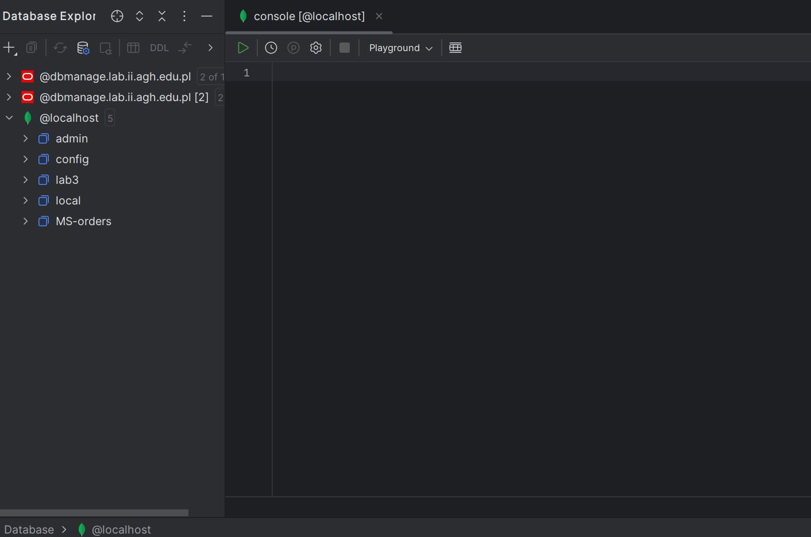
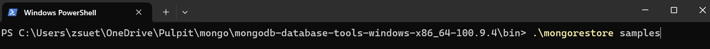
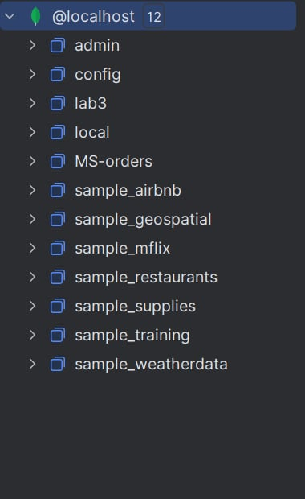
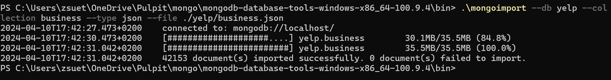
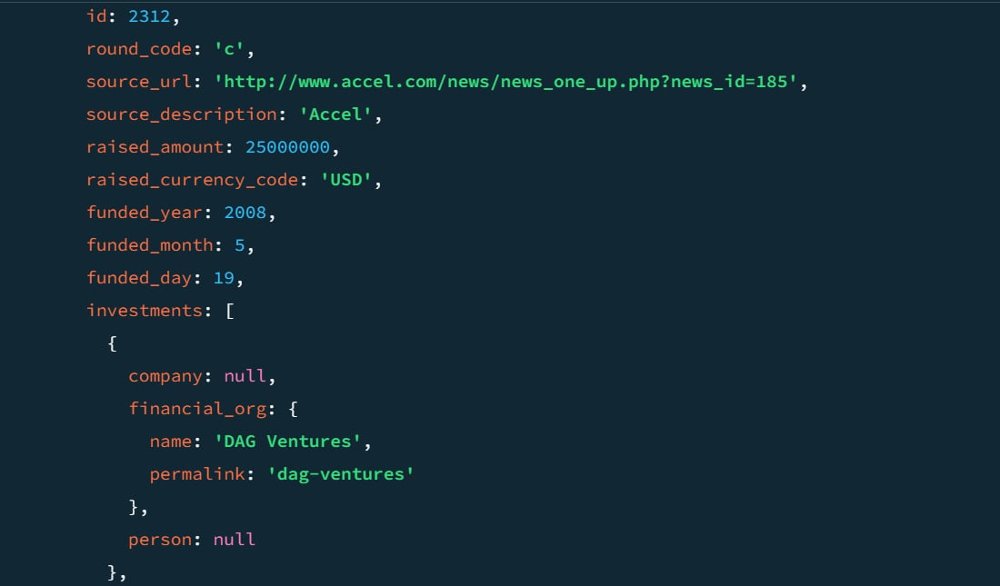
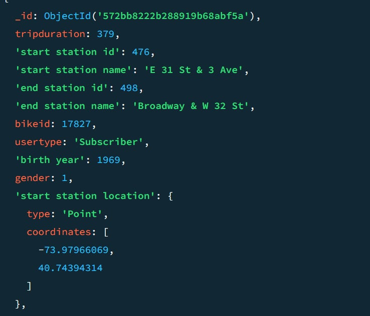
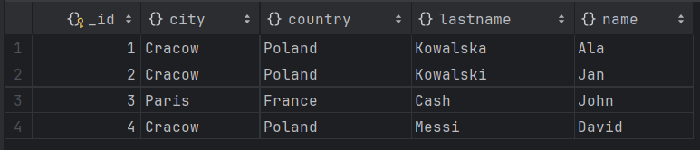
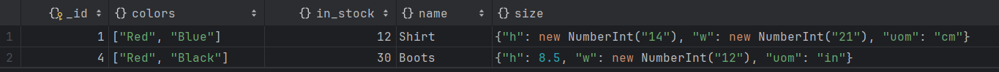
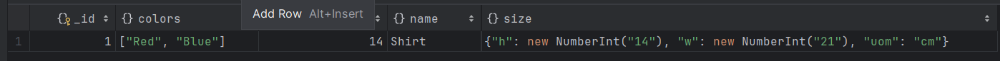
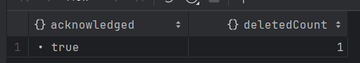

# Dokumentowe bazy danych – MongoDB

ćwiczenie 1


---

**Imiona i nazwiska autorów: Łukasz Kluza, Mateusz Sacha**

--- 

# Zadanie 1 - połączenie z serwerem bazy danych

Połącz się serwerem MongoDB

Można skorzystać z własnego/lokanego serwera MongoDB
Można stworzyć własny klaster/bazę danych w serwisie MongoDB Atlas
- [https://www.mongodb.com/atlas/database](https://www.mongodb.com/atlas/database)

Połącz za pomocą konsoli mongsh

Ewentualnie zdefiniuj połączenie w wybranym przez siebie narzędziu

Stwórz bazę danych/kolekcję/dokument
- może to być dowolna kolekcja, dowolny dokument – o dowolnej strukturze, chodzi o przetestowanie działania połączenia


---

## Zadanie 1  - rozwiązanie

> Wyniki: 

Użyliśmy DataGrip do połączenia się z bazą danych 




```js
db.collection.insertMany([{name: "Lukasz", lastname: "Kluza"},{name: "Mateusz", lastname: "Sacha"}])
db.collection.find({})
```


---


# Zadanie 2 - przykładowe zbiory danych

Zaimportuj przykładowe zbory danych

MongoDB Atlas Sample Dataset
- [https://docs.atlas.mongodb.com/sample-data](https://docs.atlas.mongodb.com/sample-data)
- w przypadku importu z lokalnych plików można wykorzystać polecenie `mongorestore`
	- [https://www.mongodb.com/docs/database-tools/mongorestore/](https://www.mongodb.com/docs/database-tools/mongorestore/)

```
mongorestore <data-dump-folder>
```

np.  

```
mongorestore samples
```

- Oczywiście, w przypadku łączenia się zdalnym serwerem należy podać parametry połączenia oraz dane logowania

Yelp Dataset

- wykorzystaj komendę `mongoimport`
- [https://www.mongodb.com/docs/database-tools/mongoimport](https://www.mongodb.com/docs/database-tools/mongoimport)

```
mongoimport --db <db-name> --collection <coll-name> --type json --file <file>
```


np.

```
mongoimport --db yelp --collection business --type json --file ./yelp_academic_dataset_business.json
```

- można też wykorzystać np.  narzędzie MongoDB Compass


Zapoznaj się ze strukturą przykładowych zbiorów danych/kolekcji
- W bazach danych: MongoDB Atlas Sample Dataset
	- Skomentuj struktury użyte w dokumentach dla dwóch wybranych zbiorów (takich które wydają ci się najciekawsze)
	- np. Sample Analitics Dataset i Sampe Traning Dataset

- W bazie Yelp
	- Skomentuj struktury użyte w dokumentach bazy Yelp

Przetestuj działanie operacji
- `mongodump`
	- [https://www.mongodb.com/docs/database-tools/mongodump/](https://www.mongodb.com/docs/database-tools/mongodump/)
- `mongoexport`
	- [https://www.mongodb.com/docs/database-tools/mongoexport/](https://www.mongodb.com/docs/database-tools/mongoexport/)

---

## Zadanie 2  - rozwiązanie

> Wyniki: 








```js
W bazie danych sample_training w kolekcji companies możemy zauważyć takie struktury jak lista oraz zagnieżdżone w struktury, które też posiadają listy.
```



```js
W bazie danych sample_training w kolekcji trips, możemy zauważyć pola napisane w ' ' z powodu tego, że zawierają spacje czyli znaki niedozwolone w normalniej nazwie pola, widzimy także użycie dokumentów zagnieżdzonych 'start station location' oraz kolejne listy.
```



```js
W bazie yelp w kolekcji business widzimy, np listy zawierjąe stringi oraz puste dumenty zagnieżdzone oraz puste listy.
```


```js
W bazie yelp w kolekcji checkin widzimy pole będące mapą/słownikiem.
```


---

# Zadanie 3 - operacje CRUD, operacje wyszukiwania danych

[https://www.mongodb.com/docs/manual/crud/](https://www.mongodb.com/docs/manual/crud/)

Stwórz nową bazę danych
- baza danych będzie przechowywać informacje o klientach, produktach, zamowieniach tych produktów. itp.
- w nazwie bazy danych użyj swoich inicjałów
	- np. `AB-orders`
- zaproponuj strukturę kolekcji/dokumentów (dwie, maksymalnie 3 kolekcje)
	- wykorzystaj typy proste/podstawowe, dokumenty zagnieżdżone, tablice itp.
	- wprowadź kilka przykładowych dokumentów
	- przetestuj operacje wstawiania, modyfikacji/usuwania dokumentów
	- przetestuj operacje wyszukiwania dokumentów

## Zadanie 3  - rozwiązanie

> Wyniki: 
> 
> przykłady, kod, zrzuty ekranów, komentarz ...

```js
db.createCollection("customers")
db.createCollection("orders")
db.createCollection("products")
```

```js
db.customers.insertMany([{_id: 1, name: "Ala", lastname: "Kowalska", country: "Poland", city: "Cracow"},
                        {_id: 2, name: "Jan", lastname: "Kowalski", country: "Poland", city: "Cracow"},
                        {_id: 3, name: "John", lastname: "Cash", country: "France", city: "Paris"},
                        {_id: 4, name: "David", lastname: "Messi", country: "Poland", city: "Cracow"}])
```



```js
db.products.insertMany([
    {_id: 1, name: "Shirt", in_stock: 12, colors: ["Red", "Blue"], size: { h: 14, w: 21, uom: "cm" }},
    {_id: 2, name: "Dress", in_stock: 100, colors: ["Green", "Blue"], size: { h: 11, w: 41, uom: "cm" }},
    {_id: 3, name: "Trouser", in_stock: 13, colors: ["Yellow", "Blue"], size: { h: 4.5, w: 11, uom: "in" }},
    {_id: 4, name: "Boots", in_stock: 30, colors: ["Red", "Black"], size: { h: 8.5, w: 12, uom: "in" }}
])
db.products.find({})
```


```js
db.orders.insertMany([
    {_id: 1, product_id: 1, customer_id: 1, quantity: 2, discount: 0.02, order_date: new Date("2024-04-09")},
    {_id: 2, product_id: 2, customer_id: 3, quantity: 5, discount: 0.12, order_date: new Date("2024-03-10")},
    {_id: 3, product_id: 3, customer_id: 4, quantity: 11, discount: 0.04, order_date: new Date("2024-04-11")},
    {_id: 4, product_id: 1, customer_id: 1, quantity: 6, discount: 0.01, order_date: new Date("2024-04-13")},
])
```


```js
db.orders.find({customer_id: 1})
```


```js
db.products.find( {
 $or: [ 
	{size: { h: 14, w: 21, uom: "cm" } },
 	{size: { h: 8.5, w: 12, uom: "in"} }
 ]
});
```



```js
db.products.find( { in_stock: { $gt: 20 } } )
```


```js
db.products.updateOne({_id: 1}, {$set: {in_stock: 14}})
```




```js
db.products.deleteOne({_id: 2})
```

<br>



<br>


---

Ćwiczenie przeznaczone jest do wykonania podczas zajęć. Pod koniec zajęć należy przesłać wyniki prac

Punktacja:

|         |     |
| ------- | --- |
| zadanie | pkt |
| 1       | 0,1 |
| 2       | 0,2 |
| 3       | 0,7 |
| razem   | 1   |
