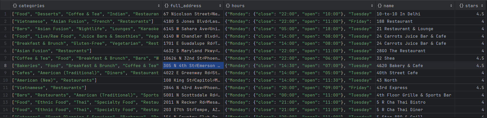
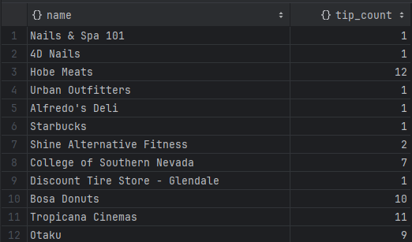
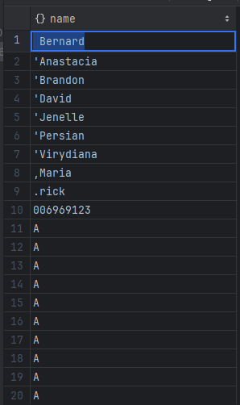
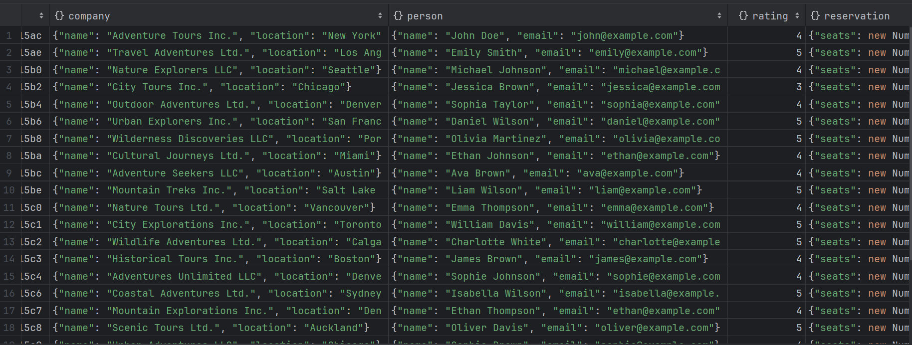
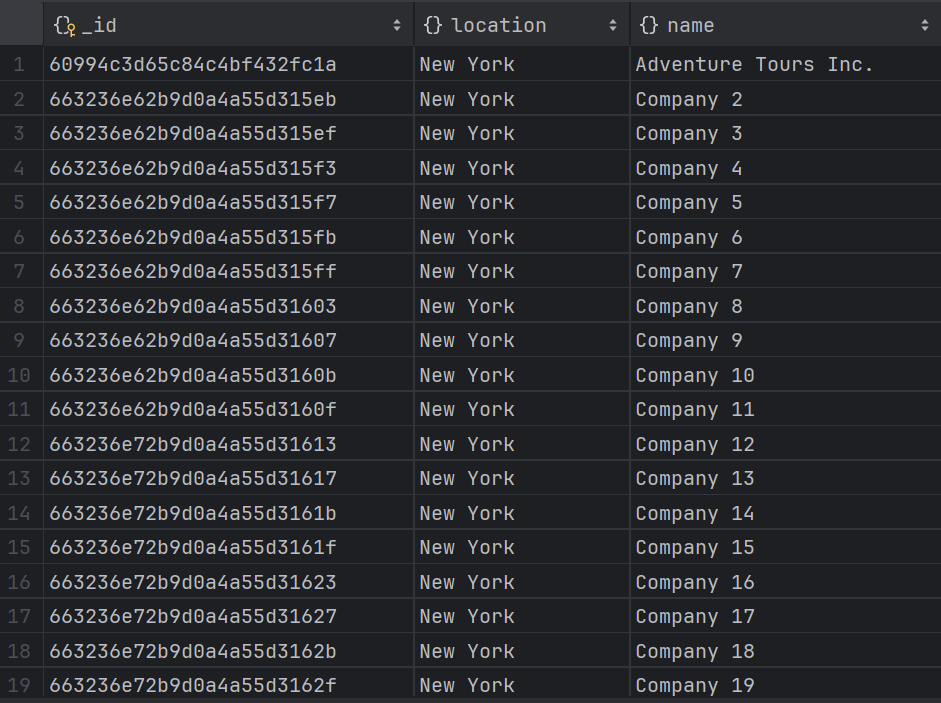
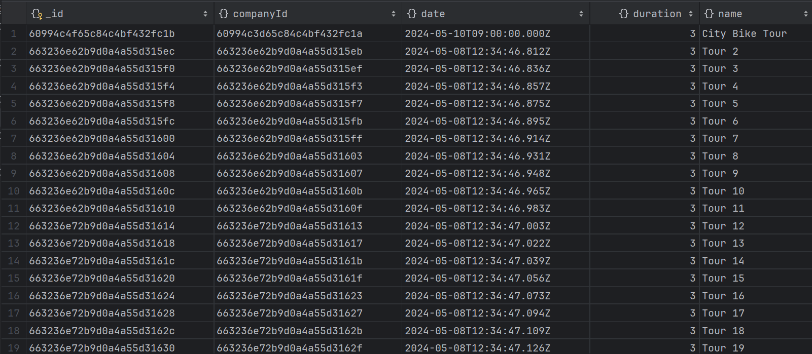
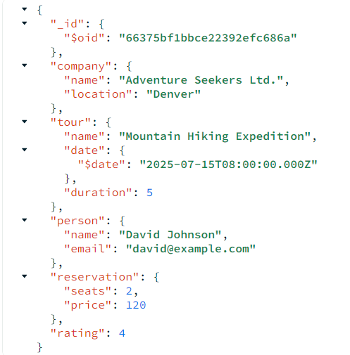
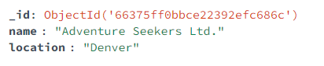

# Dokumentowe bazy danych – MongoDB

ćwiczenie 2


---

**Imiona i nazwiska autorów:**
Łukasz Kluza, Mateusz Sacha
--- 


## Yelp Dataset

- [www.yelp.com](http://www.yelp.com) - serwis społecznościowy – informacje o miejscach/lokalach
- restauracje, kluby, hotele itd. `businesses`,
- użytkownicy odwiedzają te miejsca - "meldują się"  `check-in`
- użytkownicy piszą recenzje `reviews` o miejscach/lokalach i wystawiają oceny oceny,
- przykładowy zbiór danych zawiera dane z 5 miast: Phoenix, Las Vegas, Madison, Waterloo i Edinburgh.

# Zadanie 1 - operacje wyszukiwania danych

Dla zbioru Yelp wykonaj następujące zapytania

W niektórych przypadkach może być potrzebne wykorzystanie mechanizmu Aggregation Pipeline

[https://www.mongodb.com/docs/manual/core/aggregation-pipeline/](https://www.mongodb.com/docs/manual/core/aggregation-pipeline/)


1. Zwróć dane wszystkich restauracji (kolekcja `business`, pole `categories` musi zawierać wartość "Restaurants"), które są otwarte w poniedziałki (pole hours) i mają ocenę co najmniej 4 gwiazdki (pole `stars`).  Zapytanie powinno zwracać: nazwę firmy, adres, kategorię, godziny otwarcia i gwiazdki. Posortuj wynik wg nazwy firmy.

2. Ile każda firma otrzymała ocen/wskazówek (kolekcja `tip` ) w 2012. Wynik powinien zawierać nazwę firmy oraz liczbę ocen/wskazówek Wynik posortuj według liczby ocen (`tip`).

3. Recenzje mogą być oceniane przez innych użytkowników jako `cool`, `funny` lub `useful` (kolekcja `review`, pole `votes`, jedna recenzja może mieć kilka głosów w każdej kategorii).  Napisz zapytanie, które zwraca dla każdej z tych kategorii, ile sumarycznie recenzji zostało oznaczonych przez te kategorie (np. recenzja ma kategorię `funny` jeśli co najmniej jedna osoba zagłosowała w ten sposób na daną recenzję)

4. Zwróć dane wszystkich użytkowników (kolekcja `user`), którzy nie mają ani jednego pozytywnego głosu (pole `votes`) z kategorii (`funny` lub `useful`), wynik posortuj alfabetycznie według nazwy użytkownika.

5. Wyznacz, jaką średnia ocenę uzyskała każda firma na podstawie wszystkich recenzji (kolekcja `review`, pole `stars`). Ogranicz do firm, które uzyskały średnią powyżej 3 gwiazdek.

	a) Wynik powinien zawierać id firmy oraz średnią ocenę. Posortuj wynik wg id firmy.

	b) Wynik powinien zawierać nazwę firmy oraz średnią ocenę. Posortuj wynik wg nazwy firmy.

## Zadanie 1  - rozwiązanie

> Wyniki: 
> 
> przykłady, kod, zrzuty ekranów, komentarz ...

```js
db.business.find({"categories": "Restaurants", "stars" : {$gte : 4}, "hours.Monday":{$exists : true}},
    {"_id": 0,"name" : 1, "full_address" : 1, "categories": 1, "hours": 1, "stars" :1}).sort({"name": 1})
```



```js
db.tip.aggregate([
  {
    $match: {
      date: { $gte: "2012-01-01", $lt: "2013-01-01" }
    }
  },
  {
    $group: {
      _id: "$business_id",
      tip_count: { $sum: 1 }
    }
  },
  {
    $lookup: {
      from: "business",
      localField: "_id",
      foreignField: "business_id",
      as: "business_info"
    }
  },
  {
    $unwind: "$business_info"
  },
  {
    $project: {
      _id: 0,
      name: "$business_info.name",
      tip_count: 1
    }
  },
//  {
//    $sort: { 'tip_count': -1 }
//  }
])
```



```js
db.review.aggregate([
    {
        $unwind: "$votes"
    },
    {
        $group:{
            _id: null,
            funny_sum: { $sum: "$votes.funny"},
            funny_useful: { $sum: "$votes.useful"},
            funny_cool: { $sum: "$votes.cool" }

        }
    },
    {
        $project:{
            _id: 0
        }
    }
])
```


```js
db.user.aggregate([
  {
    $group: {
      _id: "$_id",
      funny_sum: { $sum: "$votes.funny" },
      useful_sum: { $sum: "$votes.useful" },
      cool_sum: { $sum: "$votes.cool" },
      name: {$first: "$name"}
    }
  },
  {
    $match: { $or: [{ "funny_sum": 0 }, { "useful_sum": 0 }] }
  },
  {
    $sort :{ "name" : 1}
  },
  {
    $project: {
      _id: 0,
      name: 1
    }
  }
])
```


```js
db.business.aggregate([
  {
    $lookup: {
      from: "review",
      localField: "business_id",
      foreignField: "business_id",
      as: "reviews"
    }
  },
  {
    $group: {
      _id: 0,
      name: { $first: "$name" },
      average_stars: { $avg: "$reviews.stars" }
    }
  },
//  {
//    $sort: { "name": 1 }
//  }
])
```

# Zadanie 2 - modelowanie danych


Zaproponuj strukturę bazy danych dla wybranego/przykładowego zagadnienia/problemu

Należy wybrać jedno zagadnienie/problem (A lub B)

Przykład A
- Wykładowcy, przedmioty, studenci, oceny
	- Wykładowcy prowadzą zajęcia z poszczególnych przedmiotów
	- Studenci uczęszczają na zajęcia
	- Wykładowcy wystawiają oceny studentom
	- Studenci oceniają zajęcia

Przykład B
- Firmy, wycieczki, osoby
	- Firmy organizują wycieczki
	- Osoby rezerwują miejsca/wykupują bilety
	- Osoby oceniają wycieczki

a) Warto zaproponować/rozważyć różne warianty struktury bazy danych i dokumentów w poszczególnych kolekcjach oraz przeprowadzić dyskusję każdego wariantu (wskazać wady i zalety każdego z wariantów)

b) Kolekcje należy wypełnić przykładowymi danymi

c) W kontekście zaprezentowania wad/zalet należy zaprezentować kilka przykładów/zapytań/zadań/operacji oraz dla których dedykowany jest dany wariantów

W sprawozdaniu należy zamieścić przykładowe dokumenty w formacie JSON ( pkt a) i b)), oraz kod zapytań/operacji (pkt c)), wraz z odpowiednim komentarzem opisującym strukturę dokumentów oraz polecenia ilustrujące wykonanie przykładowych operacji na danych

Do sprawozdania należy kompletny zrzut wykonanych/przygotowanych baz danych (taki zrzut można wykonać np. za pomocą poleceń `mongoexport`, `mongdump` …) oraz plik z kodem operacji zapytań (załącznik powinien mieć format zip).


## Zadanie 2  - rozwiązanie

> Wyniki: 

### a)
#### Wariant 1 (embedding):
##### Struktura danych:
Jedna kolekcja zawierająca wszystkie dane o firmach, wycieczkach, osobach i rezerwacjach osadzonych w jednym dokumencie.
```js
Embedded documents:
{
  "_id": ObjectId,
  "company": {
    "name": String,
    "location": String
  },
  "tour": {
    "name": String,
    "date": Date,
    "duration": Number
  },
  "person": {
    "name": String,
    "email": String
  },
  "reservation": {
    "seats": Number,
    "price": Number
  },
  "rating": Number
}
```
##### Zalety:
* Prostota struktury danych - wszystkie powiązane dane są przechowywane w jednym dokumencie, co ułatwia ich pobieranie i aktualizację.
* Szybki dostęp do danych - nie ma potrzeby wykonywania złączeń między kolekcjami, co może poprawić wydajność zapytań.
##### Wady:
* Duplikacja danych - dane mogą być powielane w wielu dokumentach, co może prowadzić do redundancji i zwiększać rozmiar bazy danych.
* Aktualizacja danych - jeśli dane są powielane w wielu miejscach, aktualizacja ich wymaga modyfikacji wielu dokumentów, co może być czasochłonne i skomplikowane.

---

#### Wariant 2 (references):
##### Struktura danych:
Oddzielne kolekcje dla firm, wycieczek, osób i rezerwacji, z referencjami między nimi.
```js
Companies collection:
{
  "_id": ObjectId,
  "name": String,
  "location": String
}
```
```js
Trips collection:
{
  "_id": ObjectId,
  "companyId": ObjectId,
  "name": String,
  "date": Date,
  "duration": Number
}
```
```js
Persons collection:
{
  "_id": ObjectId,
  "name": String,
  "email": String
}
```
```js
Reservations collection:
{
  "_id": ObjectId,
  "tourId": ObjectId,
  "personId": ObjectId,
  "seats": Number,
  "price": Number,
  "rating": Number
}
```
##### Zalety:
* Brak duplikacji danych - każda encja jest przechowywana w osobnym dokumencie, co eliminuje redundancję danych.
* Łatwa aktualizacja - jeśli dane są przechowywane w jednym dokumencie, aktualizacja wymaga zmiany tylko jednego miejsca.
##### Wady:
* Potrzeba wykonywania złączeń - w celu pobrania powiązanych danych konieczne jest wykonanie złączeń między kolekcjami, co może wpłynąć na wydajność zapytań.
* Większa złożoność struktury danych - konieczność zarządzania referencjami między kolekcjami może sprawić, że struktura danych będzie bardziej skomplikowana.

### b)
#### Wariant 1 (przykładowe dane):

```js
{
  "_id":{"$oid":"66322ba7fc33997b00b115ac"},
  "company":{
    "name":"Adventure Tours Inc.",
    "location":"New York"
    },
  "tour":{
    "name":"City Bike Tour",
    "date":{"$date":"2024-05-10T09:00:00Z"},
    "duration":3
    },
  "person":{
    "name":"John Doe",
    "email":"john@example.com"
    },
  "reservation":{
    "seats":2,
    "price":100
    },
  "rating":4
}
```


#### Wariant 2 (przykładowe dane):
```js
Companies collection:
{
  "_id": ObjectId("60994c3d65c84c4bf432fc1a"),
  "name": "Adventure Tours Inc.",
  "location": "New York"
}
```

```js
Tours collection:
{
  "_id": ObjectId("60994c4f65c84c4bf432fc1b"),
  "companyId": ObjectId("60994c3d65c84c4bf432fc1a"),
  "name": "City Bike Tour",
  "date": ISODate("2024-05-10T09:00:00Z"),
  "duration": 3
}
```

```js
Persons collection:
{
  "_id": ObjectId("60994c7e65c84c4bf432fc1c"),
  "name": "John Doe",
  "email": "john@example.com"
}
```

```js
Reservations collection:
{
  "_id": ObjectId("60994c4f65c84c4bf432fc1b"),
  "tourId": ObjectId("60994c4f65c84c4bf432fc1b"),
  "personId": ObjectId("60994c7e65c84c4bf432fc1c"),
  "seats": 2,
  "price": 100,
  "rating": 4
}
```


- c.1 
  Rozważmy zapytanie, które mam nam zwrócić wszystkie rezerwacje danej osoby ntóre spełniją danę warunki: 
  - muszą byc zrealizowane przez daną firmę
  - ich cena powinna być większa od zadanej
  - czas ich trwania musi być równy zadanemu

Zrealizujemy teraz to zapytanie na dwóch bazach zaprojektowanych w różny spsób.
W pierwszym przypadku szukamy wszyskich rezerwacji osoby o imieniu: _William Davis_, zrealizowanych w firmie: _City Explorations Inc. z ceną powyżej_ _130_ i _trwających _4_ dni. 

Takie zapytanie możemy zrealizować tym poleceniem

```js
db.tours.find(
{
    "company.name": "City Explorations Inc.",
    "person.name": "William Davis",
    "reservation.price": {$gt: 130},
    "tour.duration": {$eq: 4},
},
{
    "_id":0,
    "person.name": 1,
    "tour.name": 1,
    "tour.duration": 1,
    "company.name": 1,
    "reservation.seats" :1,
    "reservation.price" :1,
}
)
```
Jako rezultat dostaniemy: 


W drugim przypadku ym razem szukamy wszyskich rezerwacji osoby o imieniu: _Sophia Taylor_, zrealizowanych w firmie: _Adventures Unlimited LLC_ z ceną powyżej _75_ i _trwających _5_ dni. 

Teraz polecenie realozujące to zapytanie wygląda następująco: 

```js
db.persons.aggregate([
    {
        $lookup: {
            from: "reservations",
            localField: "_id",
            foreignField: "personId",
            as: "reservation"
        }
    },
    {$unwind: "$reservation"},
    {
        $lookup: {
            from: "tours",
            localField: "reservation.tourId",
            foreignField: "_id",
            as: "tour"
        }
    },
    {$unwind: "$tour"},
    {
        $lookup: {
            from: "companies",
            localField: "tour.companyId",
            foreignField: "_id",
            as: "company"
        }
    },
    { $unwind: "$company" },
    { $match: { "name": "Sophia Taylor" } },
    { $match: { "company.name": "Adventures Unlimited LLC" } },
    { $match: { "reservation.price": { $gt: 75 } } },
    { $match: { "tour.duration": 5 } },
    {
        $project: { "_id": 0, "name": 1, "tour.name": 1, "tour.duration": 1, "company.name": 1, "reservation.seats" :1, "reservation.price" :1}
    }
])
```


##### Wnioski
Mimo, że oba polecenie relizują dokładnie to samo zapytanie tylko z innymi parametrami ich kod jest zupełnie inny. W bazie danych typu _embedding_ jest on dużo krótszy
oraz łatwiejszy do napisania i zrozumienia. Dodakowo sam czas wykonywania polecenia też jest szybszy ponieważ wykonujemy znacząco mniej operacji.
Natomiast w bazie danych typu _references_ pomimo, że nie mamy redundancji danych to samo zapytanie jest dużo bardziej skomplikowane i bardziej czasochłonne ponieważ musimy używac polecenia _$lookup_ aby połączyć dwie kolekcje w jedną.
W związku z tym baza typu _embedding_ lepiej sprawdzi się niż _references_ w sytuacji gdzie w przeciwnym wypadku musimy sięgać do wielu kolekcji jednocześnie.

- c.2
  Tym razem porównyjemy zapytania które zwracają nam unikalne imiona klientów.

_embedding_

```js
db.tours.aggregate([
  {
    $group: {
      _id: "$person.name",
    }
  }
])
```


_references_
```js
db.persons.distinct("name")
```


##### Wnioski
Do tego rodzaju zapytań lepiej sprawdzą się bazy typu _references_ ponieważ w nich z definicji dla każdego rodzaju danych mamy osobne kolekcje.
W bazie _embedding_ to zapytanie też nie jest skomplikowane ale operacja _grupowania_ może być bardziej czascohłonna niż _distinct_

- c.3
Dodawanie nowych danych: fimry, wycieczki, klienta, rezweracji:

_embedding_

```js
db.tours.insertOne(
  {
    "company": {
      "name": "Adventure Seekers Ltd.",
      "location": "Denver"
    },
    "tour": {
      "name": "Mountain Hiking Expedition",
      "date": new Date("2025-07-15T08:00:00Z"),
      "duration": 5
    },
    "person": {
      "name": "David Johnson",
      "email": "david@example.com"
    },
    "reservation": {
      "seats": 2,
      "price": 120,
    },
    "rating": 4
  },
);
```



_references_
```js
db.companies.insertOne({
    "name": "Adventure Seekers Ltd.",
    "location": "Denver"
})
```


```js
db.persons.insertOne({
    "name": "David Johnson",
    "email": "david@example.com"
})
```


```js
db.tours.insertOne({
    "companyId" : ObjectId("66375ff0bbce22392efc686c"),
    "name": "Mountain Hiking Expedition",
    "date": new Date("2025-07-15T08:00:00Z"),
    "duration": 5
})
```


```js
db.reservations.insertOne({
    "tourId": ObjectId("6637639fbbce22392efc6872"),
    "personId": ObjectId("663760f1bbce22392efc686e"),
    "seats": 2,
    "price": 120,
    "rating": 4
})
```

##### Wnioski
Dodawanie nowej rezerwacji, gdzie w bazie danych nie ma jeszcze danych klienta, firmy, wyczieczki jest dużo ładwiejsze dla bazy danych _embedding_, natomiast minusem tego podejścia jest to, że dodająć kolejne osoby do tej samej wycieczki będziemu musieli powiecać dane firmy oraz tej wycieczki. 
W bazie danych _references_ natomist musimy osobno dodać dane do każdej z kolekcji oraz zadbać o to aby kluczę obcne w relacjach były prawidłowe. Jednak dzięki temu unikamy duplikacji danych. 

---

Punktacja:

|         |     |
| ------- | --- |
| zadanie | pkt |
| 1       | 0,6 |
| 2       | 1,4 |
| razem   | 2   |


