**Imiona i nazwiska autorów:**
Łukasz Kluza, Mateusz Sacha
--- 

## Zadanie 1  - rozwiązanie

#### Product.cs
```cs
public class Product {
    public int ProductID { get; set; }
    public String? ProductName { get; set; } 
    public int UnitsInStock { get; set; }
}
```

#### ProdContext.cs
```cs
public class ProdContext : DbContext
{
    public DbSet<Product> Products { get; set; }
    protected override void OnConfiguring(DbContextOptionsBuilder optionsBuilder)
    {
        base.OnConfiguring(optionsBuilder);
        optionsBuilder.UseSqlite("Datasource=MyProductDatabase");
    }
}
```

#### Program.cs
```cs
class Program {
    static void Main() { 
        ProdContext prodContext = new ProdContext();
        Product product = CreateProduct();
        prodContext.Products.Add(product);
        prodContext.SaveChanges();

        var query = from prod in prodContext.Products
                    select prod.ProductName,
            
        foreach (var pName in query) {
            Console.WriteLine(pName);
        }
    }

    private static Product CreateProduct(){
        Console.WriteLine("Write new product name: ");
        String? prodName = Console.ReadLine();
        Product product = new Product { ProductName = prodName };
        Console.WriteLine("Write new product units in stock: ");
        String? units = Console.ReadLine();
        if(units != null) {
            int prodUnits = Int32.Parse(units);
            product.UnitsInStock = prodUnits;
        }
        return product;
    }
}
```


## Zadanie 2  - rozwiązanie

### a)

#### Product.cs
```cs
public class Product {
    public int ProductID { get; set; }
    public Supplier? Supplier { get; set; }
    public String? ProductName { get; set; } 
    public int UnitsInStock { get; set; }
}
```

#### Suppliers.cs
```cs
public class Supplier {
    public int SupplierID { get; set; }
    public String? CompanyName { get; set; } 
    public String? Street { get; set; }
    public String? City { get; set; }
}
```

#### ProdContext.cs
```cs
public class ProdContext : DbContext
{
    public DbSet<Product> Products { get; set; }
    public DbSet<Supplier> Suppliers { get; set; }
    protected override void OnConfiguring(DbContextOptionsBuilder optionsBuilder)
    {
        base.OnConfiguring(optionsBuilder);
        optionsBuilder.UseSqlite("Datasource=MyProductDatabase");
    }
}
```

#### Program.cs
```cs
class Program {
    static void Main() { 
        ProdContext prodContext = new ProdContext();
        Console.WriteLine("Do you want to add new product (yes/no): ");
        String? response = Console.ReadLine();
        if(response == "yes") {
            Product product = CreateProduct();
            prodContext.Products.Add(product);
            prodContext.SaveChanges();
        }
       
        Supplier supplier = CreateSupplier();
        prodContext.Add(supplier);

        var lastProduct = prodContext.Products
            .OrderByDescending(prod => prod.ProductID)
            .FirstOrDefault();

        if(lastProduct != null) lastProduct.Supplier = supplier;

        prodContext.SaveChanges();

        var query = from prod in prodContext.Products
            select new
            {
                prod.ProductID,
                prod.ProductName,
                SupplierName = prod.Supplier != null ? prod.Supplier.CompanyName : "Unknown"
            };

        foreach (var prod in query) {
            Console.WriteLine($"[{prod.ProductID}] | {prod.ProductName} | {prod.SupplierName}");
        }
    }

    private static Product CreateProduct(){
        Console.WriteLine("Write new product name: ");
        String? prodName = Console.ReadLine();
        Product product = new Product { ProductName = prodName };
        Console.WriteLine("Write new product units in stock: ");
        String? units = Console.ReadLine();
        if(units != null) {
            int prodUnits = Int32.Parse(units);
            product.UnitsInStock = prodUnits;
        }
        return product;
    }

    private static Supplier CreateSupplier(){
        Console.WriteLine("Write new supplier name: ");
        String? suppName = Console.ReadLine();
        Supplier supplier = new Supplier { CompanyName = suppName };
        Console.WriteLine("Write new supplier street: ");
        String? suppStreet = Console.ReadLine();
        supplier.Street = suppStreet;
        Console.WriteLine("Write new supplier city: ");
        String? suppCity = Console.ReadLine();
        supplier.City = suppCity;
        return supplier;
    }
}
```
Przykład działania z dodawaniem nowego produktu
<div align="center">
  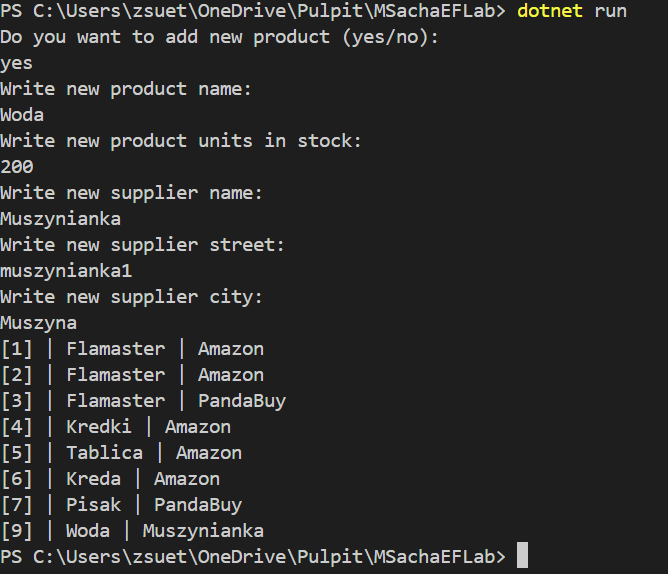
</div>

Przykład działania bez dodawania nowego produktu
<div align="center">
  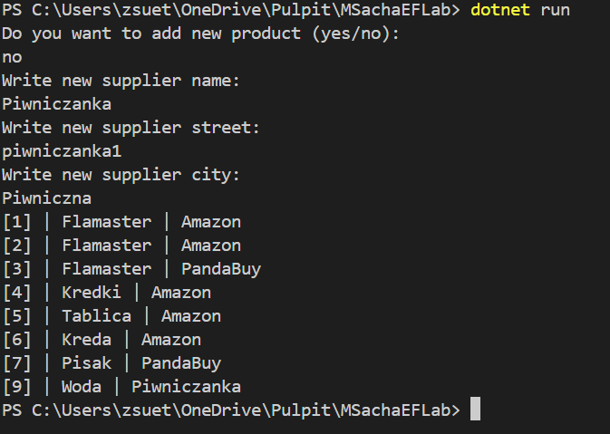
</div>

Diagram bazy danych
<div align="center">
  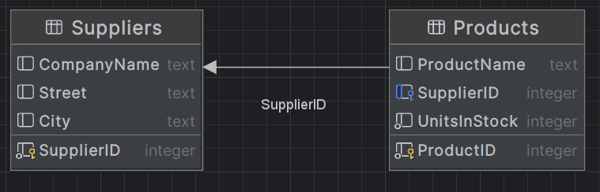
</div>

Tabela Products w bazie danych
<div align="center">
  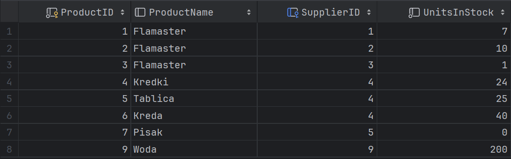
</div>

Tabela Suppliers w bazie danych
<div align="center">
  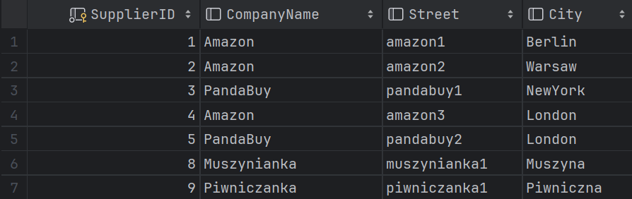
</div>


---

### b)

#### Product.cs
```cs
public class Product {
    public int ProductID { get; set; }
    public String? ProductName { get; set; } 
    public int UnitsInStock { get; set; }
}
```

#### Supplier.cs
```cs
public class Supplier {
    public int SupplierID { get; set; }
    public String? CompanyName { get; set; } 
    public String? Street { get; set; }
    public String? City { get; set; }
    public ICollection<Product> Products { get; set;} = new List<Product>();

    public override string ToString()
    {
        if (CompanyName != null)return CompanyName;
        else return "Unknow";
    }
}
```

#### Program.cs

Funkcje CreateProduct oraz CreateSupplier nie uległy zmianie
```cs
class Program {
    static void Main() { 
        ProdContext prodContext = new ProdContext();

        Supplier supplier = CreateSupplier();
        prodContext.Add(supplier);
        prodContext.SaveChanges();

        Console.WriteLine("How many products do you want to add: ");
        String? response = Console.ReadLine();
        int num = 0;
        if(response != null) num = Int32.Parse(response);

        while(num > 0) {
            Product product = CreateProduct();
            prodContext.Products.Add(product);
            supplier.Products.Add(product);
            prodContext.SaveChanges();
            num--;
        }
        
        var query = from prod in prodContext.Products
            select new
            {
                prod.ProductID,
                prod.ProductName,
            };

        foreach (var prod in query) {
            Console.WriteLine($"[{prod.ProductID}] | {prod.ProductName}");
        }
    }
}
```
Przykład działania:
<div align="center">
  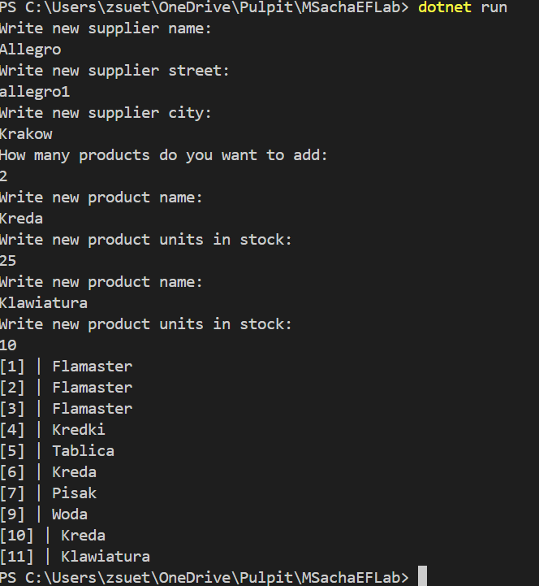
</div>

Diagram bazy danych:
<div align="center">
  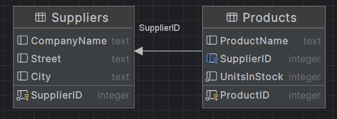
</div>
Jak widać diagram nie uległ zmianie.
<br></br>

Tabela Products w bazie danych:
<div align="center">
  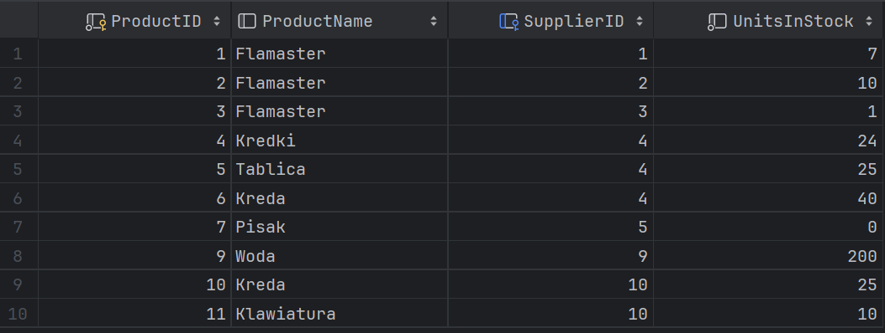
</div>

Tabela Suppliers w bazie danych:
<div align="center">
  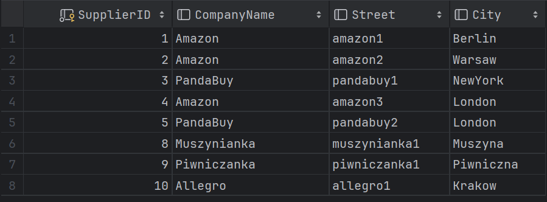
</div>

---

### c)

#### Product.cs
```cs
public class Product {
    public int ProductID { get; set; }
    public Supplier? Supplier { get; set; }
    public String? ProductName { get; set; } 
    public int UnitsInStock { get; set; }
}
```

#### Suppleir.cs
Klasa ta wygląda tak samo jak w punckie b.

#### Program.cs
Klasa ta wygląda tak samo jak w punkcie b.

Przykład działania:
<div align="center">
  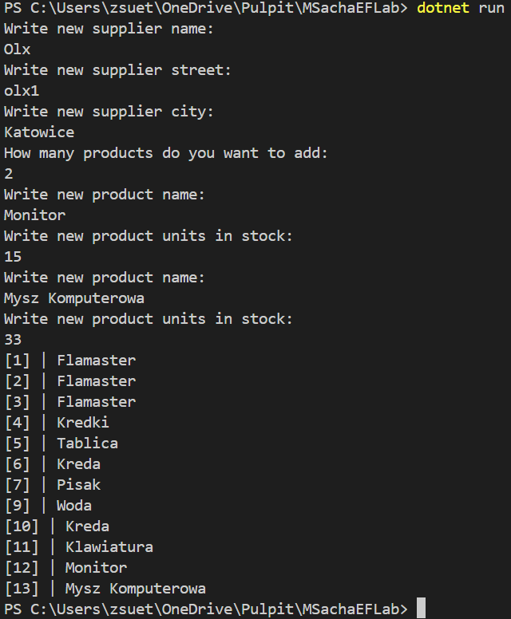
</div>

Diagram bazy danych:
<div align="center">
  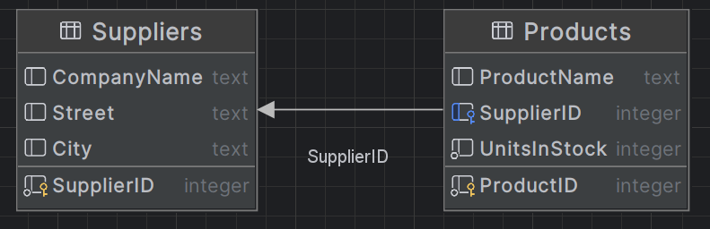
</div>
Jak widać diagram znów nie uległ zmianie.
<br></br>

Tabela Products w bazie danych:
<div align="center">
  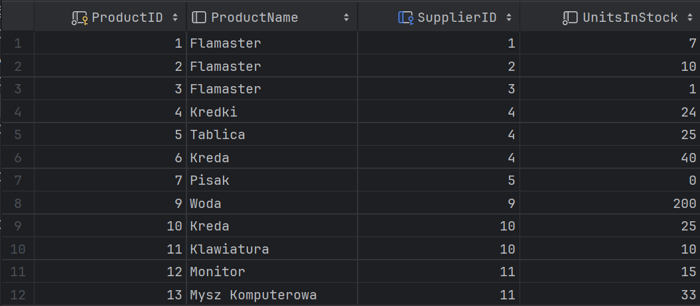
</div>

Tabela Suppliers w bazie danych:
<div align="center">
  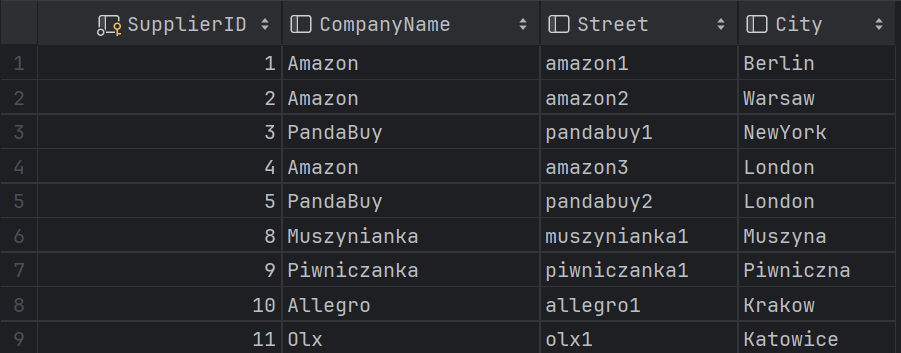
</div>

---

### d)

#### Product.cs
```cs
public class Product {
    public int ProductID { get; set; }
    public virtual ICollection<InvoiceProduct>? InvoiceProducts { get; set; }
    public String? ProductName { get; set; } 
    public int UnitsInStock { get; set; }
}
```

#### Invoice.cs
```cs
public class Invoice {
    [Key]
    public int InvoiceNumber { get; set; }
    public virtual ICollection<InvoiceProduct>? InvoiceProducts { get; set; }
```

#### InvoiceProduct.cs
```cs
public class InvoiceProduct {
    [Key, Column(Order = 0)]
    public int InvoiceID { get; set; }
    public virtual Invoice Invoice { get; set; }

    [Key, Column(Order = 1)]
    public int ProductID { get; set; }
    public virtual Product Product { get; set; }

    public int Quantity { get; set; }
}
}
```

#### ProdContext.cs
```cs
public class ProdContext : DbContext
{
    public DbSet<Product> Products { get; set; }
    public DbSet<Invoice> Invoices { get; set; }
    public DbSet<InvoiceProduct> InvoiceProducts { get; set; }

    protected override void OnModelCreating(ModelBuilder modelBuilder)
    {
        modelBuilder.Entity<InvoiceProduct>()
            .HasKey(ip => new { ip.InvoiceID, ip.ProductID });
    }

    protected override void OnConfiguring(DbContextOptionsBuilder optionsBuilder)
    {
        base.OnConfiguring(optionsBuilder);
        optionsBuilder.UseSqlite("Datasource=MyProductDatabase");
    }
}
```

#### Program.cs
```cs
class Program
{
    static void Main()
    {
        ProdContext prodContext = new ProdContext();

        Console.WriteLine("How many products do you want to add: ");
        string? response = Console.ReadLine();
        int num = 0;
        if (response != null) num = Int32.Parse(response);

        while (num > 0)
        {
            Product product = CreateProduct();
            prodContext.Products.Add(product);
            prodContext.SaveChanges();
            num--;
        }

        Console.WriteLine("How many transactions do you want to add: ");
        response = Console.ReadLine();
        num = 0;
        if (response != null) num = Int32.Parse(response);

        while (num > 0)
        {
            Console.WriteLine("Listing all products with their units in stock");
            var query = from prod in prodContext.Products
                        select new
                        {
                            prod.ProductID,
                            prod.ProductName,
                            prod.UnitsInStock,
                        };

            foreach (var prod in query)
            {
                Console.WriteLine($"[{prod.ProductID}] | {prod.ProductName} | {prod.UnitsInStock}");
            }

            Invoice invoice = CreateInvoice(prodContext);
            prodContext.Invoices.Add(invoice);
            prodContext.SaveChanges();
            num--;
        }

        Console.WriteLine("Enter the invoice number: ");
        int invoiceNumber = int.Parse(Console.ReadLine());
        ShowProductsSoldInInvoice(prodContext, invoiceNumber);

        Console.WriteLine("Enter the product ID: ");
        int productID = int.Parse(Console.ReadLine());
        ShowInvoicesForProduct(prodContext, productID);
    }

    private static Product CreateProduct()
    {
        Console.WriteLine("Write new product name: ");
        string? prodName = Console.ReadLine();
        Product product = new Product { ProductName = prodName };
        Console.WriteLine("Write new product units in stock: ");
        string? units = Console.ReadLine();
        if (units != null)
        {
            int prodUnits = Int32.Parse(units);
            product.UnitsInStock = prodUnits;
        }
        return product;
    }

    private static Invoice CreateInvoice(ProdContext prodContext)
    {
        Invoice invoice = new Invoice();
        invoice.InvoiceProducts = new List<InvoiceProduct>();

        Console.WriteLine("How many products do you want to buy: ");
        string? response = Console.ReadLine();
        int num = 0;
        if (response != null) num = Int32.Parse(response);

        while (num > 0)
        {
            Console.WriteLine("Write index of product you want to buy: ");
            string? index = Console.ReadLine();
            if (index != null)
            {
                int i = Int32.Parse(index);
                Console.WriteLine("Write how much of product you want to buy: ");
                string? count = Console.ReadLine();
                if (count != null)
                {
                    int c = Int32.Parse(count);
                    var product = prodContext.Products.FirstOrDefault(prod => prod.ProductID == i);
                    if (product != null)
                    {
                        if (product.UnitsInStock >= c)
                        {
                            InvoiceProduct invoiceProduct = new InvoiceProduct
                            {
                                Product = product,
                                Quantity = c
                            };
                            invoice.InvoiceProducts.Add(invoiceProduct);

                            product.UnitsInStock -= c;
                            Console.WriteLine("Product added to transaction.");
                            num--;
                        }
                        else
                        {
                            Console.WriteLine("There is not enough product units in stock.");
                        }
                    }
                    else
                    {
                        Console.WriteLine("Product with this index doesn't exist.");
                    }
                }
                else
                {
                    Console.WriteLine("That is not a number.");
                }
            }
        }

        return invoice;
    }

    static void ShowProductsSoldInInvoice(ProdContext prodContext, int invoiceNumber)
    {
        var productsInInvoice = prodContext.InvoiceProducts
            .Include(ip => ip.Product)
            .Where(ip => ip.InvoiceNumber == invoiceNumber)
            .ToList();

        Console.WriteLine($"\nProducts sold within the invoice {invoiceNumber}:");
        foreach (var item in productsInInvoice)
        {
            Console.WriteLine($"- Product ID: {item.ProductID}, Name: {item.Product.ProductName}, Quantity: {item.Quantity}");
        }
    }

    static void ShowInvoicesForProduct(ProdContext prodContext, int productID)
    {
        var invoicesForProduct = prodContext.InvoiceProducts
            .Include(ip => ip.Invoice)
            .Where(ip => ip.ProductID == productID)
            .Select(ip => ip.InvoiceNumber)
            .Distinct()
            .ToList();

        Console.WriteLine($"\nInvoices in which the product with ID {productID} was sold:");
        foreach (var invoiceNumber in invoicesForProduct)
        {
            Console.WriteLine($"- Invoice Number: {invoiceNumber}");
        }
    }
}
```

Przykład działania:
<div align="center">
  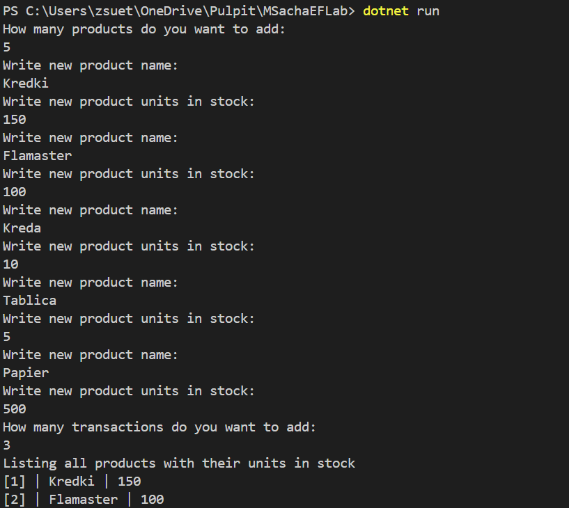
</div>

<div align="center">
  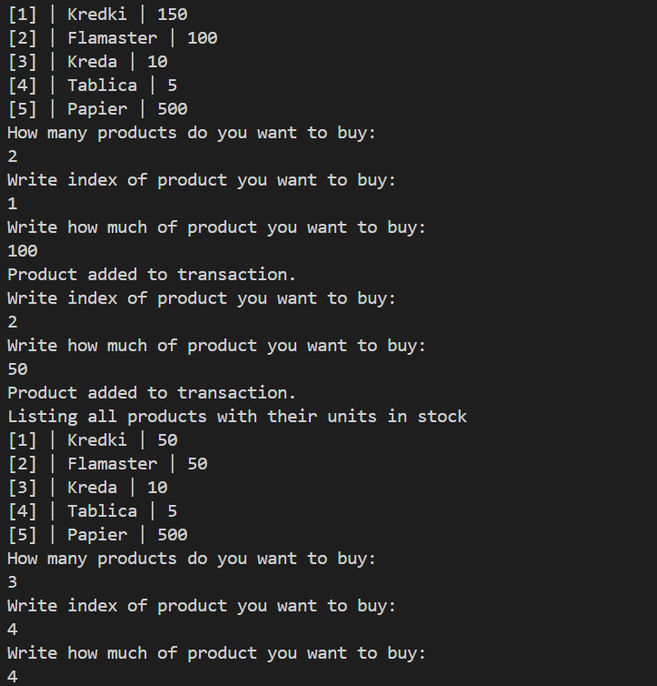
</div>

<div align="center">
  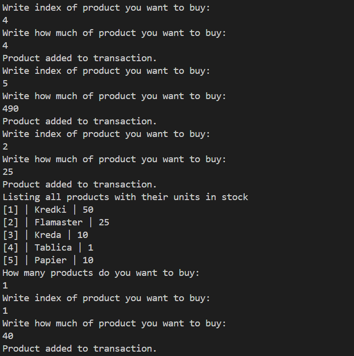
</div>

<div align="center">
  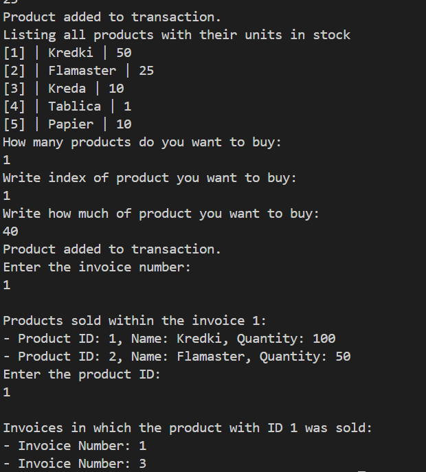
</div>

Diagram bazy danych:
<div align="center">
  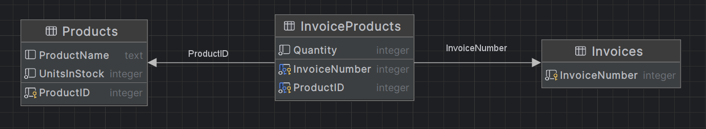
</div>

Tabela Products w bazie danych:
<div align="center">
  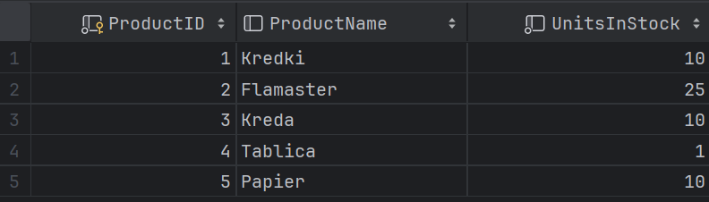
</div>

Tabela Invoices w bazie danych:
<div align="center">
  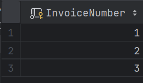
</div>

Tabela InvoiceProducts w bazie danych:
<div align="center">
  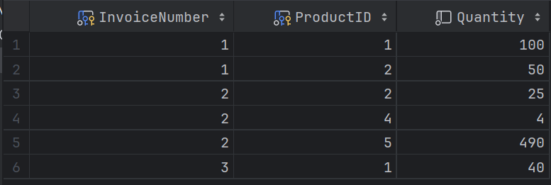
</div>

---

### e)

#### Company.cs
```cs
public abstract class Company {
    public int CompanyID { get; set; }
    public String? CompanyName { get; set; }
    public String? Street { get; set; } 
    public String? City { get; set; } 
    public String? ZipCode { get; set; } 
    
    public override string ToString()
    {
        if (CompanyName != null)return CompanyName;
        else return "Unknow";
    }
}
```

#### Supplier.cs
```cs
public class Supplier : Company {
    public String? BankAccountNumber { get; set; }
}
```

#### Customer.cs
```cs
public class Customer : Company {
    public float Discount { get; set; }
}
```

#### ProdContext.cs
```cs
public class ProdContext : DbContext
{
    public DbSet<Company>? Companies { get; set; }
    public DbSet<Supplier>? Suppliers { get; set; }
    public DbSet<Customer>? Customers { get; set; }

    protected override void OnConfiguring(DbContextOptionsBuilder optionsBuilder)
    {
        base.OnConfiguring(optionsBuilder);
        optionsBuilder.UseSqlite("Datasource=MyProductDatabase");
    }
}
```

#### Program.cs
```cs
class Program
{
    static void Main()
    {
        ProdContext prodContext = new ProdContext();

        Console.WriteLine("How many products do you want to add: ");
        string? response = Console.ReadLine();
        int num = 0;
        if (response != null) num = Int32.Parse(response);

        while(num>0)
        {
            Console.WriteLine("Enter company type (1 for Supplier, 2 for Customer): ");
            string typeInput = Console.ReadLine();
            if (typeInput == "1") 
            {
                var supplier = new Supplier();
                GetCompanyDetails(supplier);
                Console.WriteLine("Enter bank account number: ");
                supplier.BankAccountNumber = Console.ReadLine();
                prodContext.Companies.Add(supplier);
            }
            else if (typeInput == "2") 
            {
                var customer = new Customer();
                GetCompanyDetails(customer);
                Console.WriteLine("Enter discount: ");
                if (float.TryParse(Console.ReadLine(), out float discount)) 
                {
                    customer.Discount = discount;
                }
                else 
                {
                    Console.WriteLine("Invalid discount, setting to 0.");
                    customer.Discount = 0;
                }
                prodContext.Companies.Add(customer);
            }
            else 
            {
                Console.WriteLine("Invalid company type.");
                return;
            }

            prodContext.SaveChanges();
            num--;
        }

        Console.WriteLine("Companies added successfully.");
        
        var companies = prodContext.Companies.ToList();
        foreach (var company in companies)
        {
            Console.WriteLine($"Company ID: {company.CompanyID}, Name: {company.CompanyName}, Type: {company.GetType().Name}");
        } 
    }

    static void GetCompanyDetails(Company company)
    {
        Console.WriteLine("Enter company name:");
        company.CompanyName = Console.ReadLine();
        Console.WriteLine("Enter street:");
        company.Street = Console.ReadLine();
        Console.WriteLine("Enter city:");
        company.City = Console.ReadLine();
        Console.WriteLine("Enter zip code:");
        company.ZipCode = Console.ReadLine();
    }
}
```
Przykład działania:
<div align="center">
  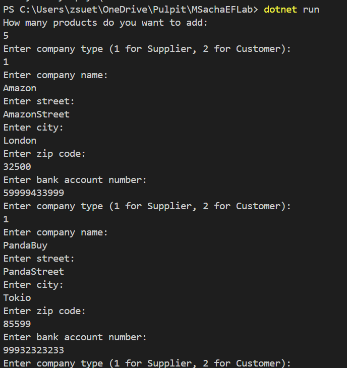
</div>

<div align="center">
  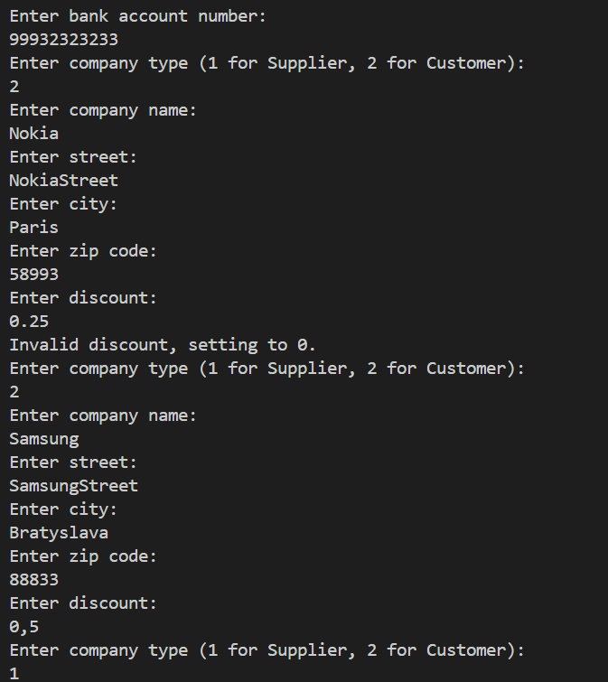
</div>

<div align="center">
  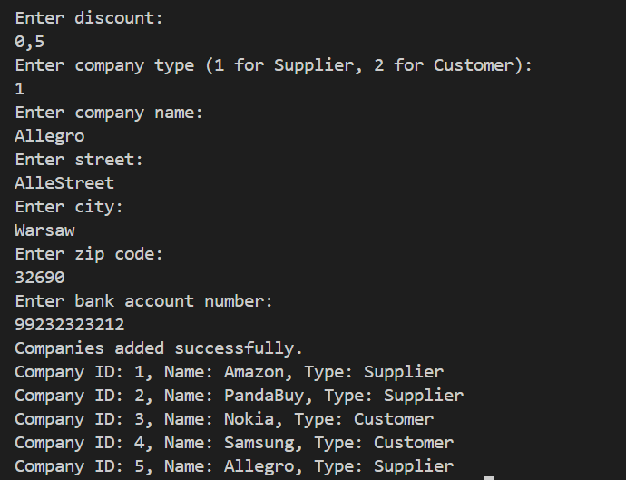
</div>

Diagram bazy danych:
<div align="center">
  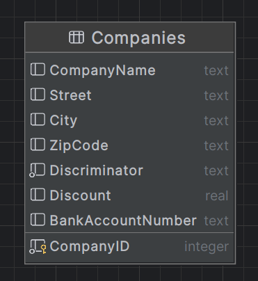
</div>

Tabela Companies w bazie danych:
<div align="center">
  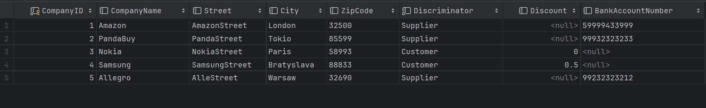
</div>

---

### f)

#### Company.cs
```cs
public class Company {
    public int CompanyID { get; set; }
    public String? CompanyName { get; set; }
    public String? Street { get; set; } 
    public String? City { get; set; } 
    public String? ZipCode { get; set; } 
    
    public override string ToString()
    {
        if (CompanyName != null)return CompanyName;
        else return "Unknow";
    }
}
```

#### Supplier.cs
Taki sam jak w punkcie e.

#### Customer.cs
Taki sam jak w punkcie e.

#### ProdContext.cs
```cs
public class ProdContext : DbContext
{
    public DbSet<Company> Companies { get; set; }
    public DbSet<Supplier> Suppliers { get; set; }
    public DbSet<Customer> Customers { get; set; }

    protected override void OnModelCreating(ModelBuilder modelBuilder)
    {
        modelBuilder.Entity<Company>().UseTptMappingStrategy();
    }

    protected override void OnConfiguring(DbContextOptionsBuilder optionsBuilder)
    {
        base.OnConfiguring(optionsBuilder);
        optionsBuilder.UseSqlite("Datasource=MyProductDatabase");
    }
}
```

#### Program.cs
Taki sam jak w punkcie e.

Przykład działania:
<div align="center">
  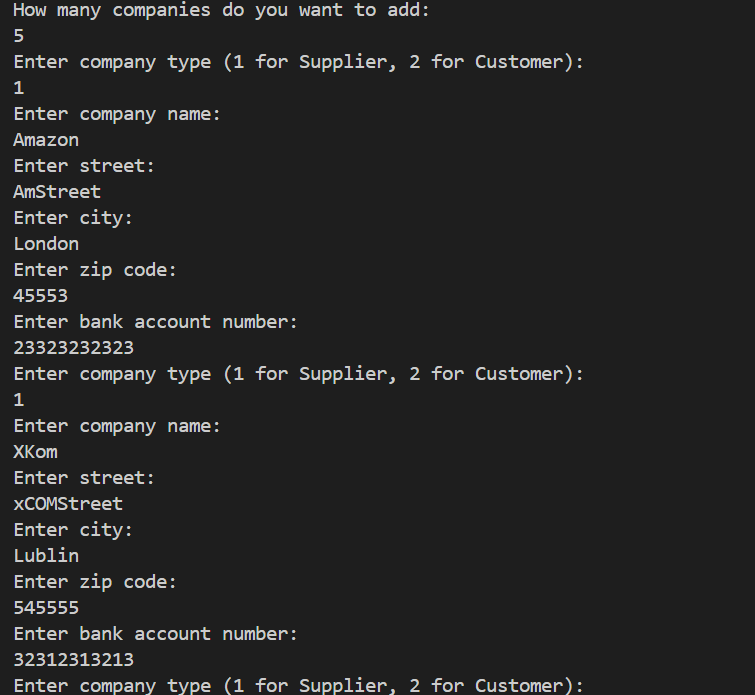
</div>

<div align="center">
  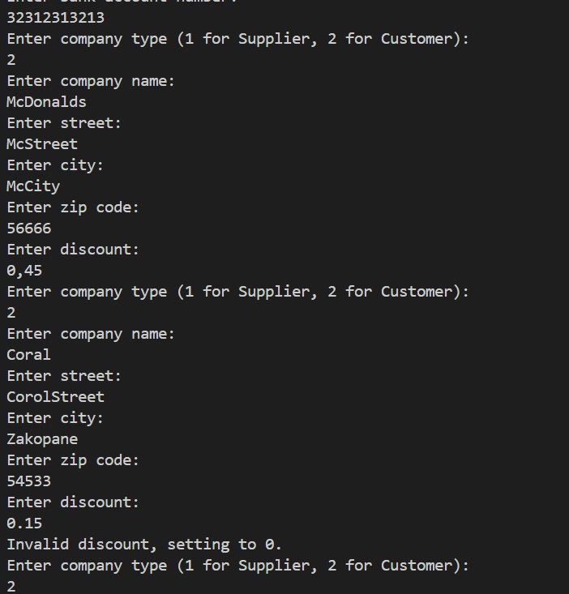
</div>

<div align="center">
  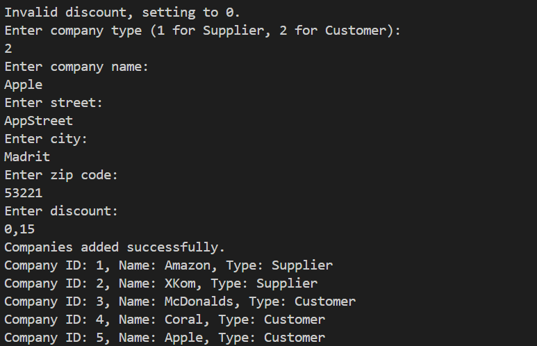
</div>

Diagram bazy danych:
<div align="center">
  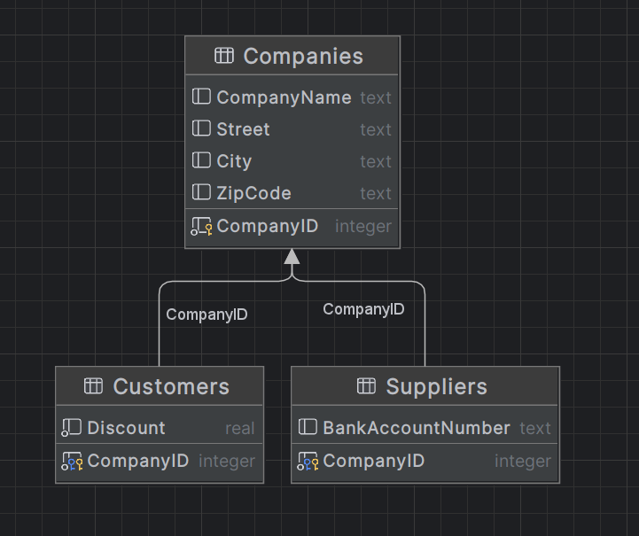
</div>

Tabela Companies w bazie danych:
<div align="center">
  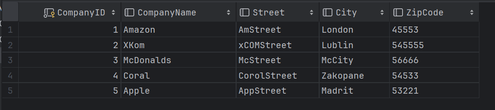
</div>

Tabela Suppliers w bazie danych:
<div align="center">
  
</div>

Tabela Customers w bazie danych:
<div align="center">
  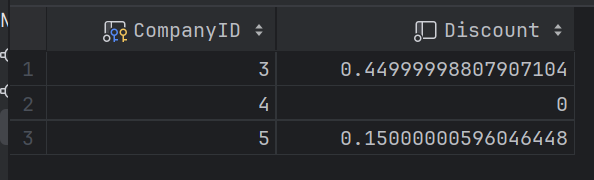
</div>

---

### g)

#### Table-Per-Type (TPT):

- **Opis:** W strategii TPT, każda klasa w hierarchii dziedziczenia odpowiada osobnej tabeli w bazie danych. Dodatkowo, klasa podstawowa również ma swoją własną tabelę. Każda tabela podtypów zawiera kolumny odpowiadające właściwościom tego podtypu, a także klucz obcy do tabeli typów podstawowych, który identyfikuje odpowiedni wiersz w tabeli typów podstawowych dla każdego wiersza podtypu.
  


#### Table-Per-Hierarchy (TPH):

- **Opis:** W strategii TPH wszystkie klasy w hierarchii dziedziczenia mapowane są do jednej tabeli w bazie danych. Tabela ta zawiera kolumny dla wszystkich właściwości wszystkich klas w hierarchii, a dodatkowy wskaźnik typu określa typ rekordu.


#### Porównanie:
- **TPH:**
  - Mniejsza liczba tabel -  dzięki temu, że wszystkie dane są przechowywane w jednej tabeli, struktura bazy danych jest prostsza.
  - Mniejsza klarowność danych - w przypadku dużej ilości klas w hierarchii, tabela może stać się bardziej złożona i trudniejsza do analizy.
  - Redundancja danych - niektóre kolumny dla określonych klas jednostek zawierają wartości NULL, a liczba tych kolumn zależy od liczby klas w hierarchii.

- **TPT:**
  - Rozdzielenie danych - każda tabela przechowuje dane tylko dla jednej konkretnej klasy, co prowadzi do klarownego przechowywania danych.
  - Łatwe dodawanie nowych klas - można łatwo dodać nowe klasy do hierarchii dziedziczenia, a EF Core automatycznie utworzy dla nich odpowiednie tabele.
  - Duża liczba tabel - struktura bazy jest bardziej złożona i powoduje to zmniejszenie wydajności operacji CRUD
  
- **Podsumowanie:**
Oba podejścia dziedziczenia mają swoje wady i zalety, preferencja wyboru powinna raczej zależeć od tego jaką strukturę bazy danych uznamy za bardziej efektywną w danym projekcie.