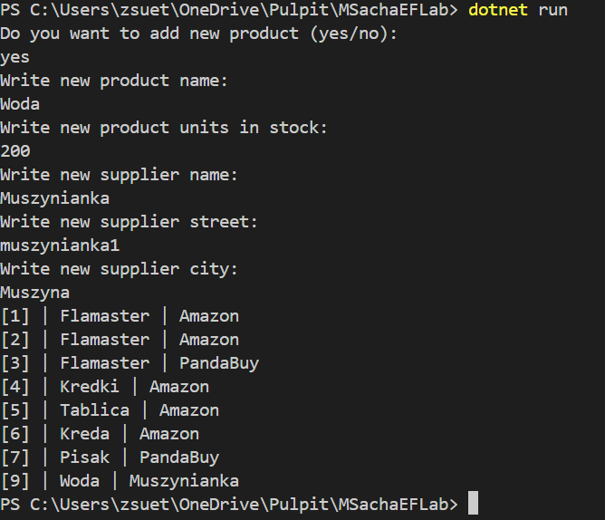
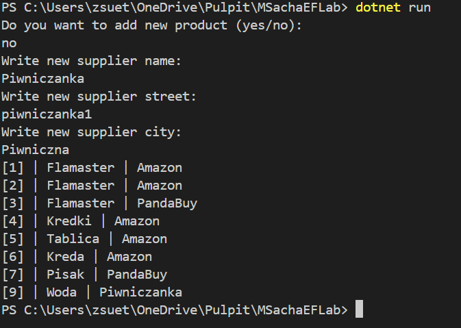
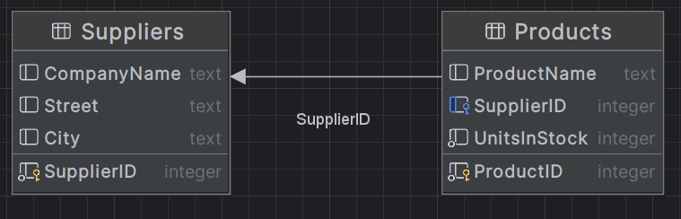
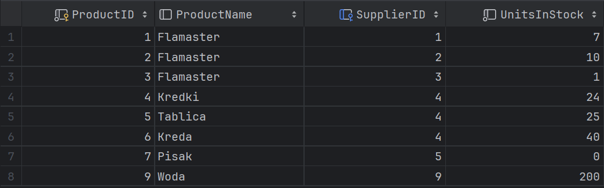
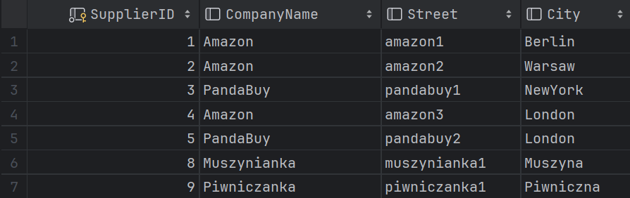
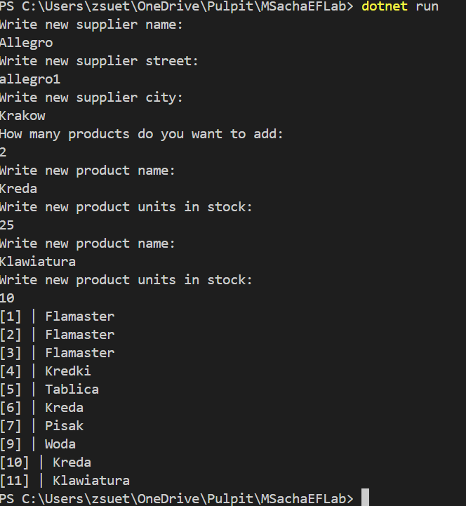
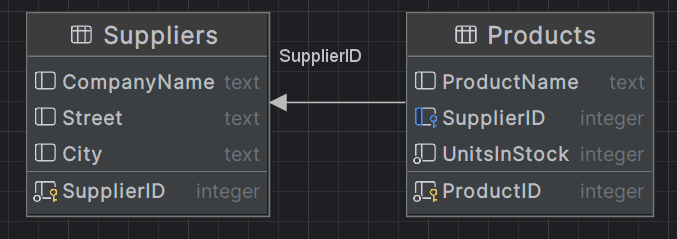
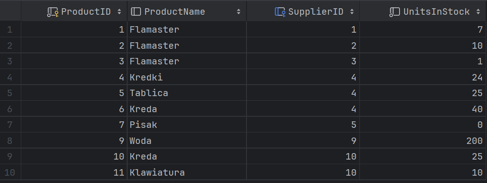
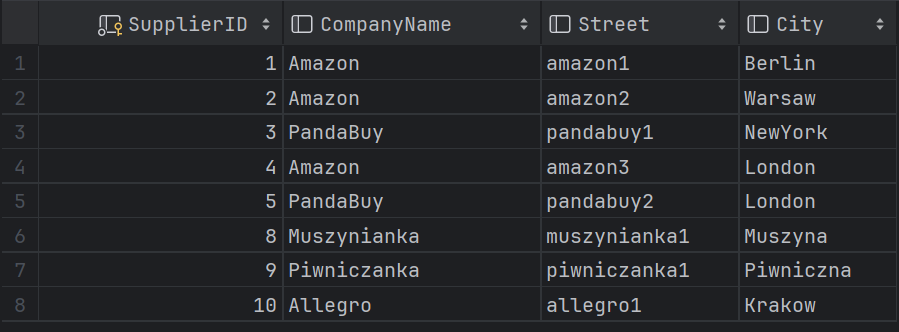

**Imiona i nazwiska autorów:**
Łukasz Kluza, Mateusz Sacha
--- 

## Zadanie 2  - rozwiązanie

### a)

#### Product.cs
```cs
public class Product {
    public int ProductID { get; set; }
    public Supplier? Supplier { get; set; }
    public String? ProductName { get; set; } 
    public int UnitsInStock { get; set; }
}
```

#### Suppliers.cs
```cs
public class Supplier {
    public int SupplierID { get; set; }
    public String? CompanyName { get; set; } 
    public String? Street { get; set; }
    public String? City { get; set; }
}
```

#### ProdContext.cs
```cs
using Microsoft.EntityFrameworkCore;
public class ProdContext : DbContext
{
    public DbSet<Product> Products { get; set; }
    public DbSet<Supplier> Suppliers { get; set; }
    protected override void OnConfiguring(DbContextOptionsBuilder optionsBuilder)
    {
        base.OnConfiguring(optionsBuilder);
        optionsBuilder.UseSqlite("Datasource=MyProductDatabase");
    }
}
```

#### Program.cs
```cs
using System;
using System.Linq;

class Program {
    static void Main() { 
        ProdContext prodContext = new ProdContext();
        Console.WriteLine("Do you want to add new product (yes/no): ");
        String? response = Console.ReadLine();
        if(response == "yes") {
            Product product = CreateProduct();
            prodContext.Products.Add(product);
            prodContext.SaveChanges();
        }
       
        Supplier supplier = CreateSupplier();
        prodContext.Add(supplier);

        var lastProduct = prodContext.Products
            .OrderByDescending(prod => prod.ProductID)
            .FirstOrDefault();

        if(lastProduct != null) lastProduct.Supplier = supplier;

        prodContext.SaveChanges();

        var query = from prod in prodContext.Products
            select new
            {
                prod.ProductID,
                prod.ProductName,
                SupplierName = prod.Supplier != null ? prod.Supplier.CompanyName : "Unknown"
            };

        foreach (var prod in query) {
            Console.WriteLine($"[{prod.ProductID}] | {prod.ProductName} | {prod.SupplierName}");
        }
    }

    private static Product CreateProduct(){
        Console.WriteLine("Write new product name: ");
        String? prodName = Console.ReadLine();
        Product product = new Product { ProductName = prodName };
        Console.WriteLine("Write new product units in stock: ");
        String? units = Console.ReadLine();
        if(units != null) {
            int prodUnits = Int32.Parse(units);
            product.UnitsInStock = prodUnits;
        }
        return product;
    }

    private static Supplier CreateSupplier(){
        Console.WriteLine("Write new supplier name: ");
        String? suppName = Console.ReadLine();
        Supplier supplier = new Supplier { CompanyName = suppName };
        Console.WriteLine("Write new supplier street: ");
        String? suppStreet = Console.ReadLine();
        supplier.Street = suppStreet;
        Console.WriteLine("Write new supplier city: ");
        String? suppCity = Console.ReadLine();
        supplier.City = suppCity;
        return supplier;
    }
}
```
Przykład działania z dodawaniem nowego produktu:


Przykład działania bez dodawania nowego produktu:


Diagram bazy danych:


Tabela Products w bazie danych:


Tabela Suppliers w bazie danych:


---

### b)

#### Product.cs
```cs
public class Product {
    public int ProductID { get; set; }
    public String? ProductName { get; set; } 
    public int UnitsInStock { get; set; }
}
```

#### Supplier.cs
```cs
public class Supplier {
    public int SupplierID { get; set; }
    public String? CompanyName { get; set; } 
    public String? Street { get; set; }
    public String? City { get; set; }
    public ICollection<Product> Products { get; set;} = new List<Product>();

    public override string ToString()
    {
        if (CompanyName != null)return CompanyName;
        else return "Unknow";
    }
}
```

#### Program.cs
Funkcje CreateProduct oraz CreateSupplier nie uległy zmianie
```cs
static void Main() { 
    ProdContext prodContext = new ProdContext();

    Supplier supplier = CreateSupplier();
    prodContext.Add(supplier);
    prodContext.SaveChanges();

    Console.WriteLine("How many products do you want to add: ");
    String? response = Console.ReadLine();
    int num = 0;
    if(response != null) num = Int32.Parse(response);

    while(num > 0) {
        Product product = CreateProduct();
        prodContext.Products.Add(product);
        supplier.Products.Add(product);
        prodContext.SaveChanges();
        num--;
    }
    
    var query = from prod in prodContext.Products
        select new
        {
            prod.ProductID,
            prod.ProductName,
        };

    foreach (var prod in query) {
        Console.WriteLine($"[{prod.ProductID}] | {prod.ProductName}");
    }
}
```
Przykład działania:


Diagram bazy danych:

Jak widać diagram nie uległ zmianie.

Tabela Products w bazie danych:


Tabela Suppliers w bazie danych:


---