# Hibernate & JPA
## Cześć 2
###### Łukasz Kluza, Mateusz Sacha

### Relacja OneToMany(Supplier -> Prodcut)

- #### Z tabelą łącznikową

##### Klasa Main:
```java
public static void main(String[] args) {
        sessionFactory = getSessionFactory();
        Session session = sessionFactory.openSession();
        Supplier ikea = new Supplier("Ikea", "Main Street", "New York");
        Supplier lidl = new Supplier("Lidl", "Second Street", "Miami");
        Supplier aldi = new Supplier("Aldi", "Kaufingerstraße", "Berlin");


        Product tv = new Product("TV", 5);
        Product phone = new Product("Phone", 5);
        Product ball = new Product("Ball", 5);
        Product teddy = new Product("Teddy", 5);

        ikea.add(tv);
        ikea.add(phone);
        lidl.add(ball);
        aldi.add(teddy);

        Transaction tx = session.beginTransaction();

        session.persist(tv);
        session.persist(phone);
        session.persist(ball);
        session.persist(teddy);

        session.persist(ikea);
        session.persist(lidl);
        session.persist(aldi);
        
        tx.commit();
        session.close();
    }
```
Klasa Prodcut:

```java
@Entity
public class Product {
    @Id
    @GeneratedValue(strategy = GenerationType.AUTO)
    private int id;
    private String productName;
    private int unitInStock;
    public Product(){}
    public Product(String productName, int unitsInStock){
        this.productName = productName;
        this.unitInStock = unitsInStock;
    }
}
```
##### Klasa Supplier

```java
@Entity
public class Supplier {
    @Id
    @GeneratedValue(strategy =  GenerationType.AUTO)
    private int id;
    private String CompanyName;
    private String Street;
    private String City;

    @OneToMany
    private final List<Product> products = new ArrayList<>();

    public Supplier(String CompanyName, String Street, String City){
        this.CompanyName = CompanyName;
        this.Street = Street;
        this.City = City;
    }
    public Supplier() {}

    public void add(Product product){
        products.add(product);
    }
}
```
##### Logi SQL

```sql
Hibernate: 
    create table Supplier (
        id integer not null,
        City varchar(255),
        CompanyName varchar(255),
        Street varchar(255),
        primary key (id)
    )
Hibernate: 
    create table Supplier_Product (
        Supplier_id integer not null,
        products_id integer not null unique
    )
Hibernate: 
    alter table Supplier_Product 
       add constraint FKnsxquwfgqd1ktlok66v4wxo8m 
       foreign key (products_id) 
       references Product
Hibernate: 
    alter table Supplier_Product 
       add constraint FK1gam671f3qabh6mhfhkav4g7s 
       foreign key (Supplier_id) 
       references Supplier
Hibernate: 
    
values
    next value for Product_SEQ
Hibernate: 
    
values
    next value for Product_SEQ
Hibernate: 
    
values
    next value for Supplier_SEQ
Hibernate: 
    
values
    next value for Supplier_SEQ
Hibernate: 
    /* insert for
        org.example.Product */insert 
    into
        Product (productName, unitInStock, id) 
    values
        (?, ?, ?)
Hibernate: 
    /* insert for
        org.example.Product */insert 
    into
        Product (productName, unitInStock, id) 
    values
        (?, ?, ?)
Hibernate: 
    /* insert for
        org.example.Product */insert 
    into
        Product (productName, unitInStock, id) 
    values
        (?, ?, ?)
Hibernate: 
    /* insert for
        org.example.Product */insert 
    into
        Product (productName, unitInStock, id) 
    values
        (?, ?, ?)
Hibernate: 
    /* insert for
        org.example.Supplier */insert 
    into
        Supplier (City, CompanyName, Street, id) 
    values
        (?, ?, ?, ?)
Hibernate: 
    /* insert for
        org.example.Supplier */insert 
    into
        Supplier (City, CompanyName, Street, id) 
    values
        (?, ?, ?, ?)
Hibernate: 
    /* insert for
        org.example.Supplier */insert 
    into
        Supplier (City, CompanyName, Street, id) 
    values
        (?, ?, ?, ?)
Hibernate: 
    /* insert for
        org.example.Supplier.products */insert 
    into
        Supplier_Product (Supplier_id, products_id) 
    values
        (?, ?)
Hibernate: 
    /* insert for
        org.example.Supplier.products */insert 
    into
        Supplier_Product (Supplier_id, products_id) 
    values
        (?, ?)
Hibernate: 
    /* insert for
        org.example.Supplier.products */insert 
    into
        Supplier_Product (Supplier_id, products_id) 
    values
        (?, ?)
Hibernate: 
    /* insert for
        org.example.Supplier.products */insert 
    into
        Supplier_Product (Supplier_id, products_id) 
    values
        (?, ?)
```

##### Schemat baz danych, zawartość tabel


- #### Bez tabeli łącznikowe 

Klasa main i product bez zmian.

##### Klasa supplier z małą zmianą: 
```java
    @OneToMany
    @JoinColumn(name = "supplier_id")
    private final List<Product> products = new ArrayList<>();
```

##### Logi SQL

```sql
Hibernate: 
    create table Supplier (
        id integer not null,
        City varchar(255),
        CompanyName varchar(255),
        Street varchar(255),
        primary key (id)
    )
Hibernate: 
    alter table Product 
       add constraint FK11uleikow9eaenolp88xnaudd 
       foreign key (supplier_id) 
       references Supplier
Hibernate: 
    
values
    next value for Product_SEQ
Hibernate: 
    
values
    next value for Product_SEQ
Hibernate: 
    
values
    next value for Supplier_SEQ
Hibernate: 
    
values
    next value for Supplier_SEQ
Hibernate: 
    /* insert for
        org.example.Product */insert 
    into
        Product (productName, unitInStock, id) 
    values
        (?, ?, ?)
Hibernate: 
    /* insert for
        org.example.Product */insert 
    into
        Product (productName, unitInStock, id) 
    values
        (?, ?, ?)
Hibernate: 
    /* insert for
        org.example.Product */insert 
    into
        Product (productName, unitInStock, id) 
    values
        (?, ?, ?)
Hibernate: 
    /* insert for
        org.example.Product */insert 
    into
        Product (productName, unitInStock, id) 
    values
        (?, ?, ?)
Hibernate: 
    /* insert for
        org.example.Supplier */insert 
    into
        Supplier (City, CompanyName, Street, id) 
    values
        (?, ?, ?, ?)
Hibernate: 
    /* insert for
        org.example.Supplier */insert 
    into
        Supplier (City, CompanyName, Street, id) 
    values
        (?, ?, ?, ?)
Hibernate: 
    /* insert for
        org.example.Supplier */insert 
    into
        Supplier (City, CompanyName, Street, id) 
    values
        (?, ?, ?, ?)
Hibernate: 
    update
        Product 
    set
        supplier_id=? 
    where
        id=?
Hibernate: 
    update
        Product 
    set
        supplier_id=? 
    where
        id=?
Hibernate: 
    update
        Product 
    set
        supplier_id=? 
    where
        id=?
Hibernate: 
    update
        Product 
    set
        supplier_id=? 
    where
        id=?
```

##### Schemat baz danych, zawartość tabel
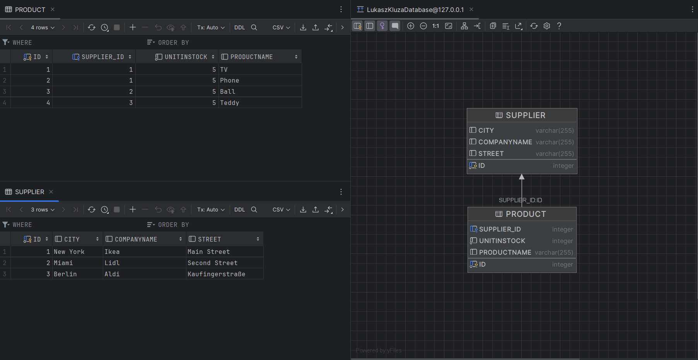

### Relacja dwustronna ManyToMany(Supplier <-> Product)

##### Klasa Main

```java
public static void main(String[] args) {
        sessionFactory = getSessionFactory();
        Session session = sessionFactory.openSession();
        Supplier ikea = new Supplier("Ikea", "Main Street", "New York");
        Supplier lidl = new Supplier("Lidl", "Second Street", "Miami");
        Supplier aldi = new Supplier("Aldi", "Kaufingerstraße", "Berlin");


        Product tv = new Product("TV", 5);
        Product phone = new Product("Phone", 5);
        Product ball = new Product("Ball", 5);
        Product teddy = new Product("Teddy", 5);

        tv.setSupplier(ikea);
        phone.setSupplier(ikea);
        ball.setSupplier(lidl);
        teddy.setSupplier(aldi);

        ikea.add(tv);
        ikea.add(phone);
        lidl.add(ball);
        aldi.add(teddy);

        Transaction tx = session.beginTransaction();

        session.persist(tv);
        session.persist(phone);
        session.persist(ball);
        session.persist(teddy);

        session.persist(ikea);
        session.persist(lidl);
        session.persist(aldi);

        tx.commit();
        //SELECT * FROM Product
        Query<Product> products =  session.createQuery("from Product ", Product.class);
        products.list().stream()
                .map(Product::toString)
                .forEach(System.out::println);

        //SELECT * FROM Supplier
        Query<Supplier> suppliers =  session.createQuery("from Supplier ", Supplier.class);
        suppliers.list().stream()
                .map(Supplier::toString)
                .forEach(System.out::println);

        session.close();
    }
```

##### Klasa Product

```java
@Entity
public class Product {
    @Id
    @GeneratedValue(strategy = GenerationType.AUTO)
    private int id;
    private String productName;
    private int unitInStock;

    @ManyToOne
    @JoinColumn(name = "SupplierID")
    private Supplier supplier;
    public Product(){}
    public Product(String productName, int unitsInStock){
        this.productName = productName;
        this.unitInStock = unitsInStock;
    }
    public void setSupplier(Supplier supplier){
        this.supplier = supplier;
    }

    public Supplier getSupplier(){
        return supplier;
    }

    @Override
    public String toString() {
        return "Product{" +
                "id=" + id +
                ", productName='" + productName + '\'' +
                ", unitInStock=" + unitInStock +
                ", supplier=" + supplier +
                '}';
    }
}
```

##### Klasa Supplier

```java
@Entity
public class Supplier {
    @Id
    @GeneratedValue(strategy = GenerationType.AUTO)
    private int id;
    private String CompanyName;
    private String Street;
    private String City;

    @OneToMany(mappedBy = "supplier")
    private final List<Product> products = new ArrayList<>();

    public Supplier(String CompanyName, String Street, String City){
        this.CompanyName = CompanyName;
        this.Street = Street;
        this.City = City;
    }
    public Supplier() {}

    public void add(Product product){
        products.add(product);
    }

    @Override
    public String toString() {
        return "Supplier{" +
                "CompanyName='" + CompanyName + '\'' +
                ", Street='" + Street + '\'' +
                '}';
    }
}
```
##### Logi SQL

```sql
Hibernate: 
    create table Product (
        SupplierID integer,
        id integer not null,
        unitInStock integer not null,
        productName varchar(255),
        primary key (id)
    )
Hibernate: 
    create table Supplier (
        id integer not null,
        City varchar(255),
        CompanyName varchar(255),
        Street varchar(255),
        primary key (id)
    )
Hibernate: 
    alter table Product 
       add constraint FKkgin78bfutrn59mng5xbhor2d 
       foreign key (SupplierID) 
       references Supplier
Hibernate: 
    
values
    next value for Product_SEQ
Hibernate: 
    
values
    next value for Product_SEQ
Hibernate: 
    
values
    next value for Supplier_SEQ
Hibernate: 
    
values
    next value for Supplier_SEQ
Hibernate: 
    /* insert for
        org.example.Product */insert 
    into
        Product (productName, SupplierID, unitInStock, id) 
    values
        (?, ?, ?, ?)
Hibernate: 
    /* insert for
        org.example.Product */insert 
    into
        Product (productName, SupplierID, unitInStock, id) 
    values
        (?, ?, ?, ?)
Hibernate: 
    /* insert for
        org.example.Product */insert 
    into
        Product (productName, SupplierID, unitInStock, id) 
    values
        (?, ?, ?, ?)
Hibernate: 
    /* insert for
        org.example.Product */insert 
    into
        Product (productName, SupplierID, unitInStock, id) 
    values
        (?, ?, ?, ?)
Hibernate: 
    /* insert for
        org.example.Supplier */insert 
    into
        Supplier (City, CompanyName, Street, id) 
    values
        (?, ?, ?, ?)
Hibernate: 
    /* insert for
        org.example.Supplier */insert 
    into
        Supplier (City, CompanyName, Street, id) 
    values
        (?, ?, ?, ?)
Hibernate: 
    /* insert for
        org.example.Supplier */insert 
    into
        Supplier (City, CompanyName, Street, id) 
    values
        (?, ?, ?, ?)
Hibernate: 
    /* update
        for org.example.Product */update Product 
    set
        productName=?,
        SupplierID=?,
        unitInStock=? 
    where
        id=?
Hibernate: 
    /* update
        for org.example.Product */update Product 
    set
        productName=?,
        SupplierID=?,
        unitInStock=? 
    where
        id=?
Hibernate: 
    /* update
        for org.example.Product */update Product 
    set
        productName=?,
        SupplierID=?,
        unitInStock=? 
    where
        id=?
Hibernate: 
    /* update
        for org.example.Product */update Product 
    set
        productName=?,
        SupplierID=?,
        unitInStock=? 
    where
        id=?
Hibernate: 
    /* 
from
    Product  */ select
        p1_0.id,
        p1_0.productName,
        p1_0.SupplierID,
        p1_0.unitInStock 
    from
        Product p1_0
Hibernate: 
    /* 
from
    Supplier  */ select
        s1_0.id,
        s1_0.City,
        s1_0.CompanyName,
        s1_0.Street 
    from
        Supplier s1_0
```

##### Dane wynikowe programu

```java
Product{id=1, productName='TV', unitInStock=5, supplier=
Supplier{CompanyName='Ikea', Street='Main Street'}}

Product{id=2, productName='Phone', unitInStock=5, supplier=
Supplier{CompanyName='Ikea', Street='Main Street'}}

Product{id=3, productName='Ball', unitInStock=5, supplier=
Supplier{CompanyName='Lidl', Street='Second Street'}}

Product{id=4, productName='Teddy', unitInStock=5, supplier=
Supplier{CompanyName='Aldi', Street='Kaufingerstraße'}}


Supplier{CompanyName='Ikea', Street='Main Street'}
Supplier{CompanyName='Lidl', Street='Second Street'}
Supplier{CompanyName='Aldi', Street='Kaufingerstraße'}
```
##### Schemat baz danych, zawartość tabel
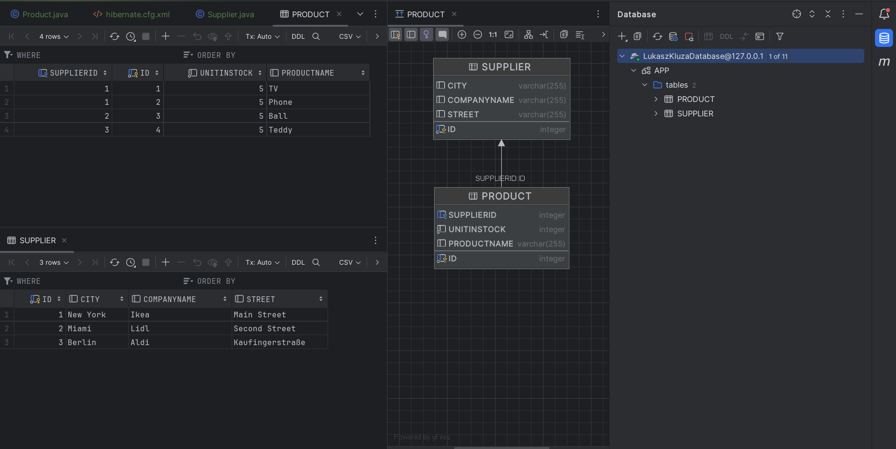

### Dodanie klasy Category 

##### Konfiguracja

W konfiguracji dodałem 

```JSON
<mapping class="org.example.Category"></mapping>
```

##### Klasa Main

```java
 public static void main(String[] args) {
        sessionFactory = getSessionFactory();
        Session session = sessionFactory.openSession();
        Supplier ikea = new Supplier("Ikea", "Main Street", "New York");
        Supplier lidl = new Supplier("Lidl", "Second Street", "Miami");
        Supplier aldi = new Supplier("Aldi", "Kaufingerstraße", "Berlin");

        Product tv = new Product("TV", 5);
        Product phone = new Product("Phone", 5);
        Product ball = new Product("Ball", 5);
        Product teddy = new Product("Teddy", 5);

        Category electronics = new Category("Electronics");
        Category toys = new Category("Toys");

        tv.setSupplier(ikea);
        tv.setCategory(electronics);

        phone.setSupplier(ikea);
        phone.setCategory(electronics);

        ball.setSupplier(lidl);
        ball.setCategory(toys);

        teddy.setSupplier(aldi);
        teddy.setCategory(toys);


        ikea.add(tv);
        ikea.add(phone);
        lidl.add(ball);
        aldi.add(teddy);

        electronics.add(tv);
        electronics.add(phone);
        toys.add(ball);
        toys.add(teddy);

        Transaction tx = session.beginTransaction();

        session.persist(tv);
        session.persist(phone);
        session.persist(ball);
        session.persist(teddy);

        session.persist(ikea);
        session.persist(lidl);
        session.persist(aldi);

        session.persist(electronics);
        session.persist(toys);

        tx.commit();
        //SELECT * FROM Product
        Query<Product> products =  session.createQuery("from Product ", Product.class);
        products.list().stream()
                .map(Product::toString)
                .forEach(System.out::println);

        //SELECT * FROM Supplier
        Query<Supplier> suppliers =  session.createQuery("from Supplier ", Supplier.class);
        suppliers.list().stream()
                .map(Supplier::toString)
                .forEach(System.out::println);

        //SELECT * FROM Category
        Query<Category> categories =  session.createQuery("from Category", Category.class);
        categories.list().stream()
                .map(Category::toString)
                .forEach(System.out::println);

        session.close();
    }
```
##### Klasa Product

```java
@Entity
public class Product {
    @Id
    @GeneratedValue(strategy = GenerationType.AUTO)
    private int id;
    private String productName;
    private int unitInStock;

    @ManyToOne
    @JoinColumn(name = "SupplierID")
    private Supplier supplier;

    @ManyToOne
    @JoinColumn(name = "CategoryID")
    private Category category;

    public Product(){}
    public Product(String productName, int unitsInStock){
        this.productName = productName;
        this.unitInStock = unitsInStock;
    }
    public void setSupplier(Supplier supplier){
        this.supplier = supplier;
    }

    public Supplier getSupplier(){
        return supplier;
    }

    public Category getCategory() {
        return category;
    }

    public void setCategory(Category category) {
        this.category = category;
    }

    public String getName(){
        return productName;
    }
    @Override
    public String toString() {
        return "Product{" +
                "productName='" + productName + '\'' +
                ", unitInStock=" + unitInStock +
                ", supplier=" + supplier +
                ", category=" + category.getName() +
                '}';
    }
}
```
##### Klasa Category

```java
@Entity
public class Category {
    @Id
    @GeneratedValue(generator = "auto")
    private int id;
    private String name;
    @OneToMany(mappedBy = "category")
    private List<Product> productList = new ArrayList<>();
    public Category (){}
    public Category(String name){
        this.name = name;
    }

    public void add(Product product){
        productList.add(product);
    }
    public String getName(){
        return name;
    }

    @Override
    public String toString() {
        return "Category{" +
                "name='" + name + '\'' +
                ", productList=" + productList.stream().map(Product::getName).toList() +
                '}';
    }
}
```

Klasa supplier bez zmian

##### Logi SQL


```sql
Hibernate: 
    create table Category (
        id integer not null,
        name varchar(255),
        primary key (id)
    )
Hibernate: 
    create table Product (
        CategoryID integer,
        SupplierID integer,
        id integer not null,
        unitInStock integer not null,
        productName varchar(255),
        primary key (id)
    )
Hibernate: 
    create table Supplier (
        id integer not null,
        City varchar(255),
        CompanyName varchar(255),
        Street varchar(255),
        primary key (id)
    )
Hibernate: 
    alter table Product 
       add constraint FKf9oip6g0rdsqr327ymf173jf9 
       foreign key (CategoryID) 
       references Category
Hibernate: 
    alter table Product 
       add constraint FKkgin78bfutrn59mng5xbhor2d 
       foreign key (SupplierID) 
       references Supplier
Hibernate: 
    
values
    next value for Product_SEQ
Hibernate: 
    
values
    next value for Product_SEQ
Hibernate: 
    
values
    next value for Supplier_SEQ
Hibernate: 
    
values
    next value for Supplier_SEQ
Hibernate: 
    
values
    next value for auto
Hibernate: 
    
values
    next value for auto
Hibernate: 
    /* insert for
        org.example.Product */insert 
    into
        Product (CategoryID, productName, SupplierID, unitInStock, id) 
    values
        (?, ?, ?, ?, ?)
Hibernate: 
    /* insert for
        org.example.Product */insert 
    into
        Product (CategoryID, productName, SupplierID, unitInStock, id) 
    values
        (?, ?, ?, ?, ?)
Hibernate: 
    /* insert for
        org.example.Product */insert 
    into
        Product (CategoryID, productName, SupplierID, unitInStock, id) 
    values
        (?, ?, ?, ?, ?)
Hibernate: 
    /* insert for
        org.example.Product */insert 
    into
        Product (CategoryID, productName, SupplierID, unitInStock, id) 
    values
        (?, ?, ?, ?, ?)
Hibernate: 
    /* insert for
        org.example.Supplier */insert 
    into
        Supplier (City, CompanyName, Street, id) 
    values
        (?, ?, ?, ?)
Hibernate: 
    /* insert for
        org.example.Supplier */insert 
    into
        Supplier (City, CompanyName, Street, id) 
    values
        (?, ?, ?, ?)
Hibernate: 
    /* insert for
        org.example.Supplier */insert 
    into
        Supplier (City, CompanyName, Street, id) 
    values
        (?, ?, ?, ?)
Hibernate: 
    /* insert for
        org.example.Category */insert 
    into
        Category (name, id) 
    values
        (?, ?)
Hibernate: 
    /* insert for
        org.example.Category */insert 
    into
        Category (name, id) 
    values
        (?, ?)
Hibernate: 
    /* update
        for org.example.Product */update Product 
    set
        CategoryID=?,
        productName=?,
        SupplierID=?,
        unitInStock=? 
    where
        id=?
Hibernate: 
    /* update
        for org.example.Product */update Product 
    set
        CategoryID=?,
        productName=?,
        SupplierID=?,
        unitInStock=? 
    where
        id=?
Hibernate: 
    /* update
        for org.example.Product */update Product 
    set
        CategoryID=?,
        productName=?,
        SupplierID=?,
        unitInStock=? 
    where
        id=?
Hibernate: 
    /* update
        for org.example.Product */update Product 
    set
        CategoryID=?,
        productName=?,
        SupplierID=?,
        unitInStock=? 
    where
        id=?
Hibernate: 
    /* 
from
    Product  */ select
        p1_0.id,
        p1_0.CategoryID,
        p1_0.productName,
        p1_0.SupplierID,
        p1_0.unitInStock 
    from
        Product p1_0
Hibernate: 
    /* 
from
    Supplier  */ select
        s1_0.id,
        s1_0.City,
        s1_0.CompanyName,
        s1_0.Street 
    from
        Supplier s1_0
Hibernate: 
    /* 
from
    Category */ select
        c1_0.id,
        c1_0.name 
    from
        Category c1_0
```

##### Dane wymikowe programu


```java
Product{productName='TV', unitInStock=5, supplier=
Supplier{CompanyName='Ikea', Street='Main Street'}, category=Electronics}

Product{productName='Phone', unitInStock=5, supplier=
Supplier{CompanyName='Ikea', Street='Main Street'}, category=Electronics}

Product{productName='Ball', unitInStock=5, supplier=
Supplier{CompanyName='Lidl', Street='Second Street'}, category=Toys}

Product{productName='Teddy', unitInStock=5, supplier=
Supplier{CompanyName='Aldi', Street='Kaufingerstraße'}, category=Toys}


Supplier{CompanyName='Ikea', Street='Main Street'}
Supplier{CompanyName='Lidl', Street='Second Street'}
Supplier{CompanyName='Aldi', Street='Kaufingerstraße'}

Category{name='Electronics', productList=[TV, Phone]}
Category{name='Toys', productList=[Ball, Teddy]}
```

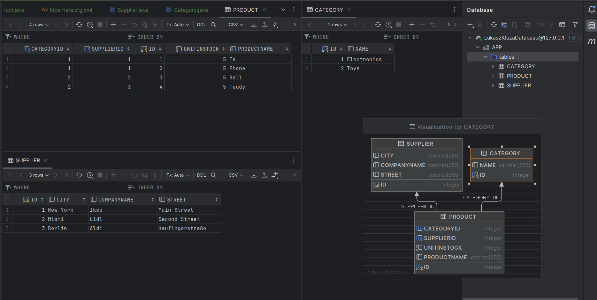

### Dodanie klasy Invoice i relacja ManyToMany(Invoice<->Product)

##### Klasa Main

```java
public static void main(String[] args) {
        sessionFactory = getSessionFactory();
        Session session = sessionFactory.openSession();
        Supplier ikea = new Supplier("Ikea", "Main Street", "New York");
        Supplier lidl = new Supplier("Lidl", "Second Street", "Miami");
        Supplier aldi = new Supplier("Aldi", "Kaufingerstraße", "Berlin");

        Product tv = new Product("TV", 15);
        Product phone = new Product("Phone", 20);
        Product ball = new Product("Ball", 10);
        Product teddy = new Product("Teddy", 25);
        List<Product> products = Stream.of(tv,phone, ball, teddy).toList();

        Category electronics = new Category("Electronics");
        Category toys = new Category("Toys");

        tv.setSupplier(ikea);
        tv.setCategory(electronics);

        phone.setSupplier(ikea);
        phone.setCategory(electronics);

        ball.setSupplier(lidl);
        ball.setCategory(toys);

        teddy.setSupplier(aldi);
        teddy.setCategory(toys);


        ikea.add(tv);
        ikea.add(phone);
        lidl.add(ball);
        aldi.add(teddy);

        electronics.add(tv);
        electronics.add(phone);
        toys.add(ball);
        toys.add(teddy);

        int sold = 10;
        Invoice invoice1 =  new Invoice();
        Invoice invoice2 =  new Invoice();
        for(Product product : products){
            try{
                invoice1.add(product, sold);
                product.addInvoice(invoice1);

                invoice2.add(product, sold);
                product.addInvoice(invoice2);

            }catch (IllegalArgumentException e){
                System.err.println(e + product.toString());
            }
        }

        Transaction tx = session.beginTransaction();

        for(Product product : products){
            session.persist(product);
        }

        session.persist(ikea);
        session.persist(lidl);
        session.persist(aldi);

        session.persist(electronics);
        session.persist(toys);

        session.persist(invoice1);
        session.persist(invoice2);

        tx.commit();

        //SELECT * FROM Product
        Query<Product> productsQuery =  session.createQuery("from Product ", Product.class);
        //SELECT * FROM Supplier
        Query<Supplier> suppliersQuery =  session.createQuery("from Supplier ", Supplier.class);
        //SELECT * FROM Category
        Query<Category> categoriesQuery =  session.createQuery("from Category", Category.class);
        //SELECT * FROM Invoice
        Query<Invoice> invoicesQuery =  session.createQuery("from Invoice ", Invoice.class);

        display(productsQuery, Product::toString);
        display(suppliersQuery, Supplier::toString);
        display(categoriesQuery, Category::toString);
        display(invoicesQuery, Invoice::toString);
        session.close();

    }

    private static <T> void display(Query<T> query, Function<T, String> toString) {
        query.list().stream()
                .map(toString)
                .forEach(System.out::println);
    }
```

##### Klasa Product

```java
@Entity
public class Product {
    @Id
    @GeneratedValue(strategy = GenerationType.AUTO)
    private int id;
    private String productName;
    private int unitInStock;

    @ManyToOne
    @JoinColumn(name = "SupplierID")
    private Supplier supplier;

    @ManyToOne
    @JoinColumn(name = "CategoryID")
    private Category category;

    @ManyToMany(mappedBy = "products")
    private final Set<Invoice> invoices = new HashSet<>();

    public Product(){}
    public Product(String productName, int unitsInStock){
        this.productName = productName;
        this.unitInStock = unitsInStock;
    }

    public void setSupplier(Supplier supplier){
        this.supplier = supplier;
    }

    public Supplier getSupplier(){
        return supplier;
    }

    public Category getCategory() {
        return category;
    }

    public void setCategory(Category category) {
        this.category = category;
    }

    public String getName(){
        return productName;
    }

    public void addInvoice(Invoice invoice){
        invoices.add(invoice);
    }
    public int getUnitInStock(){
        return unitInStock;
    }
    public void updateUnitInStock(int unitInStock){
        this.unitInStock = unitInStock;
    }
    @Override
    public String toString() {
        return "Product{" +
                "productName='" + productName + '\'' +
                ", unitInStock=" + unitInStock +
                ", supplier=" + supplier +
                ", category=" + category.getName() +
                ", invoices=" + invoices.stream()
                    .map(Invoice::getInvoiceNumber).toList()+
                '}';
    }
}
```
##### Klasa Invoice

```java
@Entity
public class Invoice {
    @Id
    @GeneratedValue(strategy = GenerationType.AUTO)
    private int invoiceNumber;
    private int quantity;
    @ManyToMany
    private final Set<Product> products = new HashSet<>();
    public Invoice(){}
    public void add(Product product, int quantity){
        if(product.getUnitInStock() < quantity){
            throw new IllegalArgumentException("Too small unit in stock: ");
        }
        product.updateUnitInStock(product.getUnitInStock()-quantity);
        products.add(product);
        this.quantity += quantity;
    }
    public int getInvoiceNumber(){
        return invoiceNumber;
    }

    @Override
    public String toString() {
        return "Invoice{" +
                "InvoiceNumber=" + invoiceNumber +
                ", Quantity=" + quantity +
                products.stream().map(Product::getName).toList()+
                '}';
    }
}
```

Klasa Supplier i Category pozostają bez zmian.

##### Logi SQL

```sql
Hibernate: 
    create table Category (
        id integer not null,
        name varchar(255),
        primary key (id)
    )
Hibernate: 
    create table Invoice (
        invoiceNumber integer not null,
        quantity integer not null,
        primary key (invoiceNumber)
    )
Hibernate: 
    create table Invoice_Product (
        invoices_invoiceNumber integer not null,
        products_id integer not null,
        primary key (invoices_invoiceNumber, products_id)
    )
Hibernate: 
    create table Product (
        CategoryID integer,
        SupplierID integer,
        id integer not null,
        unitInStock integer not null,
        productName varchar(255),
        primary key (id)
    )
Hibernate: 
    create table Supplier (
        id integer not null,
        City varchar(255),
        CompanyName varchar(255),
        Street varchar(255),
        primary key (id)
    )
Hibernate: 
    alter table Invoice_Product 
       add constraint FKeqaqmkvudj6nt4if9hk8dtafp 
       foreign key (products_id) 
       references Product
Hibernate: 
    alter table Invoice_Product 
       add constraint FKcbqyl9u4eh1tws13u6pk5j2nt 
       foreign key (invoices_invoiceNumber) 
       references Invoice
Hibernate: 
    alter table Product 
       add constraint FKf9oip6g0rdsqr327ymf173jf9 
       foreign key (CategoryID) 
       references Category
Hibernate: 
    alter table Product 
       add constraint FKkgin78bfutrn59mng5xbhor2d 
       foreign key (SupplierID) 
       references Supplier
Hibernate: 
    
values
    next value for Product_SEQ
Hibernate: 
    
values
    next value for Product_SEQ
Hibernate: 
    
values
    next value for Supplier_SEQ
Hibernate: 
    
values
    next value for Supplier_SEQ
Hibernate: 
    
values
    next value for auto
Hibernate: 
    
values
    next value for auto
Hibernate: 
    
values
    next value for Invoice_SEQ
Hibernate: 
    
values
    next value for Invoice_SEQ
Hibernate: 
    /* insert for
        org.example.Product */insert 
    into
        Product (CategoryID, productName, SupplierID, unitInStock, id) 
    values
        (?, ?, ?, ?, ?)
Hibernate: 
    /* insert for
        org.example.Product */insert 
    into
        Product (CategoryID, productName, SupplierID, unitInStock, id) 
    values
        (?, ?, ?, ?, ?)
Hibernate: 
    /* insert for
        org.example.Product */insert 
    into
        Product (CategoryID, productName, SupplierID, unitInStock, id) 
    values
        (?, ?, ?, ?, ?)
Hibernate: 
    /* insert for
        org.example.Product */insert 
    into
        Product (CategoryID, productName, SupplierID, unitInStock, id) 
    values
        (?, ?, ?, ?, ?)
Hibernate: 
    /* insert for
        org.example.Supplier */insert 
    into
        Supplier (City, CompanyName, Street, id) 
    values
        (?, ?, ?, ?)
Hibernate: 
    /* insert for
        org.example.Supplier */insert 
    into
        Supplier (City, CompanyName, Street, id) 
    values
        (?, ?, ?, ?)
Hibernate: 
    /* insert for
        org.example.Supplier */insert 
    into
        Supplier (City, CompanyName, Street, id) 
    values
        (?, ?, ?, ?)
Hibernate: 
    /* insert for
        org.example.Category */insert 
    into
        Category (name, id) 
    values
        (?, ?)
Hibernate: 
    /* insert for
        org.example.Category */insert 
    into
        Category (name, id) 
    values
        (?, ?)
Hibernate: 
    /* insert for
        org.example.Invoice */insert 
    into
        Invoice (quantity, invoiceNumber) 
    values
        (?, ?)
Hibernate: 
    /* insert for
        org.example.Invoice */insert 
    into
        Invoice (quantity, invoiceNumber) 
    values
        (?, ?)
Hibernate: 
    /* update
        for org.example.Product */update Product 
    set
        CategoryID=?,
        productName=?,
        SupplierID=?,
        unitInStock=? 
    where
        id=?
Hibernate: 
    /* update
        for org.example.Product */update Product 
    set
        CategoryID=?,
        productName=?,
        SupplierID=?,
        unitInStock=? 
    where
        id=?
Hibernate: 
    /* update
        for org.example.Product */update Product 
    set
        CategoryID=?,
        productName=?,
        SupplierID=?,
        unitInStock=? 
    where
        id=?
Hibernate: 
    /* update
        for org.example.Product */update Product 
    set
        CategoryID=?,
        productName=?,
        SupplierID=?,
        unitInStock=? 
    where
        id=?
Hibernate: 
    /* insert for
        org.example.Invoice.products */insert 
    into
        Invoice_Product (invoices_invoiceNumber, products_id) 
    values
        (?, ?)
Hibernate: 
    /* insert for
        org.example.Invoice.products */insert 
    into
        Invoice_Product (invoices_invoiceNumber, products_id) 
    values
        (?, ?)
Hibernate: 
    /* insert for
        org.example.Invoice.products */insert 
    into
        Invoice_Product (invoices_invoiceNumber, products_id) 
    values
        (?, ?)
Hibernate: 
    /* insert for
        org.example.Invoice.products */insert 
    into
        Invoice_Product (invoices_invoiceNumber, products_id) 
    values
        (?, ?)
Hibernate: 
    /* insert for
        org.example.Invoice.products */insert 
    into
        Invoice_Product (invoices_invoiceNumber, products_id) 
    values
        (?, ?)
Hibernate: 
    /* insert for
        org.example.Invoice.products */insert 
    into
        Invoice_Product (invoices_invoiceNumber, products_id) 
    values
        (?, ?)
Hibernate: 
    /* 
from
    Product  */ select
        p1_0.id,
        p1_0.CategoryID,
        p1_0.productName,
        p1_0.SupplierID,
        p1_0.unitInStock 
    from
        Product p1_0
Hibernate: 
    /* 
from
    Supplier  */ select
        s1_0.id,
        s1_0.City,
        s1_0.CompanyName,
        s1_0.Street 
    from
        Supplier s1_0
Hibernate: 
    /* 
from
    Category */ select
        c1_0.id,
        c1_0.name 
    from
        Category c1_0
Hibernate: 
    /* 
from
    Invoice  */ select
        i1_0.invoiceNumber,
        i1_0.quantity 
    from
        Invoice i1_0
```

##### Dane Wynikowe Programu

```java
java.lang.IllegalArgumentException: Too small unit in stock: 
Product{productName='TV', unitInStock=5, supplier=
Supplier{CompanyName='Ikea', Street='Main Street'}, category=Electronics, invoices=[0]}

java.lang.IllegalArgumentException: Too small unit in stock: 
Product{productName='Ball', unitInStock=0, supplier=
Supplier{CompanyName='Lidl', Street='Second Street'}, category=Toys, invoices=[0]}


Product{productName='TV', unitInStock=5, supplier=
Supplier{CompanyName='Ikea', Street='Main Street'}, category=Electronics, invoices=[1]}

Product{productName='Phone', unitInStock=0, supplier=
Supplier{CompanyName='Ikea', Street='Main Street'}, category=Electronics, invoices=[2, 1]}

Product{productName='Ball', unitInStock=0, supplier=
Supplier{CompanyName='Lidl', Street='Second Street'}, category=Toys, invoices=[1]}

Product{productName='Teddy', unitInStock=5, supplier=
Supplier{CompanyName='Aldi', Street='Kaufingerstraße'}, category=Toys, invoices=[2, 1]}


Supplier{CompanyName='Ikea', Street='Main Street'}
Supplier{CompanyName='Lidl', Street='Second Street'}
Supplier{CompanyName='Aldi', Street='Kaufingerstraße'}


Category{name='Electronics', productList=[TV, Phone]}
Category{name='Toys', productList=[Ball, Teddy]}


Invoice{InvoiceNumber=1, Quantity=40[Ball, TV, Phone, Teddy]}
Invoice{InvoiceNumber=2, Quantity=20[Phone, Teddy]}
```

##### Schemat baz danych, zawartość tabel
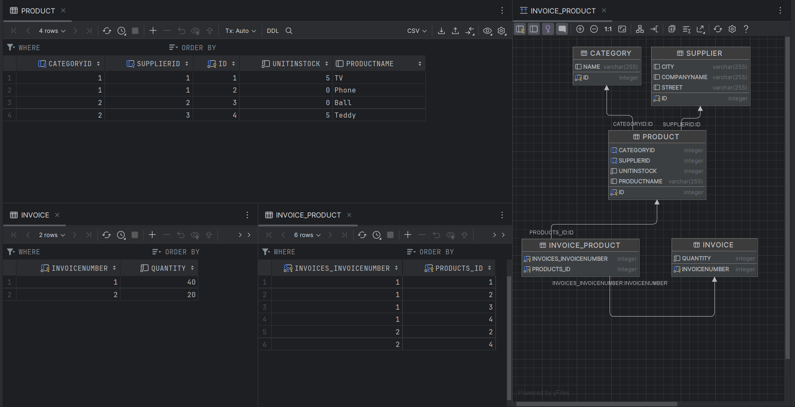

### JPA

##### Plik konfiguracyjny

```xml
<?xml version="1.0"?>
<persistence xmlns="http://java.sun.com/xml/ns/persistence"
             xmlns:xsi="http://www.w3.org/2001/XMLSchema-instance"
             xsi:schemaLocation="http://java.sun.com/xml/ns/persistence
http://java.sun.com/xml/ns/persistence/persistence_2_0.xsd"
             version="2.0">
    <persistence-unit name="myDatabaseConfig"
                      transaction-type="RESOURCE_LOCAL">
        <properties>
            <property name="hibernate.connection.driver_class"
                      value="org.apache.derby.jdbc.ClientDriver"/>
            <property name="hibernate.connection.url"
                      value="jdbc:derby://localhost/LukaszKluzaDatabase"/>
            <property name="hibernate.show_sql" value="true" />
            <property name="hibernate.format_sql" value="true" />
            <property name="hibernate.hbm2ddl.auto" value="create-drop" />
        </properties>
    </persistence-unit>
</persistence>
```

##### Klasa Main

```java
public static void main(String[] args) {
        EntityManagerFactory emf = Persistence.createEntityManagerFactory("myDatabaseConfig");
        EntityManager em = emf.createEntityManager();

        Supplier ikea = new Supplier("Ikea", "Main Street", "New York");
        Supplier lidl = new Supplier("Lidl", "Second Street", "Miami");
        Supplier aldi = new Supplier("Aldi", "Kaufingerstraße", "Berlin");

        Product tv = new Product("TV", 15);
        Product phone = new Product("Phone", 20);
        Product ball = new Product("Ball", 10);
        Product teddy = new Product("Teddy", 25);
        List<Product> products = Stream.of(tv,phone, ball, teddy).toList();

        Category electronics = new Category("Electronics");
        Category toys = new Category("Toys");

        tv.setSupplier(ikea);
        tv.setCategory(electronics);

        phone.setSupplier(ikea);
        phone.setCategory(electronics);

        ball.setSupplier(lidl);
        ball.setCategory(toys);

        teddy.setSupplier(aldi);
        teddy.setCategory(toys);


        ikea.add(tv);
        ikea.add(phone);
        lidl.add(ball);
        aldi.add(teddy);

        electronics.add(tv);
        electronics.add(phone);
        toys.add(ball);
        toys.add(teddy);

        int sold = 10;
        Invoice invoice1 =  new Invoice();
        Invoice invoice2 =  new Invoice();
        for(Product product : products){
            try{
                invoice1.add(product, sold);
                product.addInvoice(invoice1);

                invoice2.add(product, sold);
                product.addInvoice(invoice2);

            }catch (IllegalArgumentException e){
                System.err.println(e + product.toString());
            }
        }

        EntityTransaction etx = em.getTransaction();
        etx.begin();

        for(Product product : products){
            em.persist(product);
        }

        em.persist(ikea);
        em.persist(lidl);
        em.persist(aldi);

        em.persist(electronics);
        em.persist(toys);

        em.persist(invoice1);
        em.persist(invoice2);

        etx.commit();

        // SELECT * FROM Product
        List<Product> productList = em.createQuery("from Product", Product.class).getResultList();
        display(productList, Product::toString);

        // SELECT * FROM Supplier
        List<Supplier> supplierList = em.createQuery("from Supplier", Supplier.class).getResultList();
        display(supplierList, Supplier::toString);

        // SELECT * FROM Category
        List<Category> categoryList = em.createQuery("from Category", Category.class).getResultList();
        display(categoryList, Category::toString);

        // SELECT * FROM Invoice
        List<Invoice> invoiceList = em.createQuery("from Invoice", Invoice.class).getResultList();
        display(invoiceList, Invoice::toString);

        em.close();
    }

    private static <T> void display(List<T> list, Function<T, String> toString) {
        list.stream()
                .map(toString)
                .forEach(System.out::println);
    }
```

Pozostałe klasy bez zmian

##### Logi SQL

```sql
Hibernate: 
    create table Category (
        id integer not null,
        name varchar(255),
        primary key (id)
    )
Hibernate: 
    create table Company (
        discount float(52),
        id integer not null,
        DTYPE varchar(31) not null,
        city varchar(255),
        companyName varchar(255),
        street varchar(255),
        zipCode varchar(255),
        primary key (id)
    )
Hibernate: 
    create table Invoice (
        invoiceNumber integer not null,
        quantity integer not null,
        primary key (invoiceNumber)
    )
Hibernate: 
    create table Invoice_Product (
        invoices_invoiceNumber integer not null,
        products_id integer not null,
        primary key (invoices_invoiceNumber, products_id)
    )
Hibernate: 
    create table Product (
        CategoryID integer,
        SupplierID integer,
        id integer not null,
        unitInStock integer not null,
        productName varchar(255),
        primary key (id)
    )
Hibernate: 
    create table Supplier (
        id integer not null,
        City varchar(255),
        CompanyName varchar(255),
        Street varchar(255),
        primary key (id)
    )
Hibernate: 
    alter table Invoice_Product 
       add constraint FKeqaqmkvudj6nt4if9hk8dtafp 
       foreign key (products_id) 
       references Product
Hibernate: 
    alter table Invoice_Product 
       add constraint FKcbqyl9u4eh1tws13u6pk5j2nt 
       foreign key (invoices_invoiceNumber) 
       references Invoice
Hibernate: 
    alter table Product 
       add constraint FKf9oip6g0rdsqr327ymf173jf9 
       foreign key (CategoryID) 
       references Category
Hibernate: 
    alter table Product 
       add constraint FKkgin78bfutrn59mng5xbhor2d 
       foreign key (SupplierID) 
       references Supplier
Hibernate: 
    
values
    next value for Product_SEQ
Hibernate: 
    
values
    next value for auto
Hibernate: 
    
values
    next value for Supplier_SEQ
Hibernate: 
    
values
    next value for Product_SEQ
Hibernate: 
    
values
    next value for auto
Hibernate: 
    
values
    next value for Supplier_SEQ
Hibernate: 
    
values
    next value for Invoice_SEQ
Hibernate: 
    
values
    next value for Invoice_SEQ
Hibernate: 
    insert 
    into
        Category
        (name, id) 
    values
        (?, ?)
Hibernate: 
    insert 
    into
        Supplier
        (City, CompanyName, Street, id) 
    values
        (?, ?, ?, ?)
Hibernate: 
    insert 
    into
        Product
        (CategoryID, productName, SupplierID, unitInStock, id) 
    values
        (?, ?, ?, ?, ?)
Hibernate: 
    insert 
    into
        Product
        (CategoryID, productName, SupplierID, unitInStock, id) 
    values
        (?, ?, ?, ?, ?)
Hibernate: 
    insert 
    into
        Category
        (name, id) 
    values
        (?, ?)
Hibernate: 
    insert 
    into
        Supplier
        (City, CompanyName, Street, id) 
    values
        (?, ?, ?, ?)
Hibernate: 
    insert 
    into
        Product
        (CategoryID, productName, SupplierID, unitInStock, id) 
    values
        (?, ?, ?, ?, ?)
Hibernate: 
    insert 
    into
        Supplier
        (City, CompanyName, Street, id) 
    values
        (?, ?, ?, ?)
Hibernate: 
    insert 
    into
        Product
        (CategoryID, productName, SupplierID, unitInStock, id) 
    values
        (?, ?, ?, ?, ?)
Hibernate: 
    insert 
    into
        Invoice
        (quantity, invoiceNumber) 
    values
        (?, ?)
Hibernate: 
    insert 
    into
        Invoice
        (quantity, invoiceNumber) 
    values
        (?, ?)
Hibernate: 
    insert 
    into
        Invoice_Product
        (invoices_invoiceNumber, products_id) 
    values
        (?, ?)
Hibernate: 
    insert 
    into
        Invoice_Product
        (invoices_invoiceNumber, products_id) 
    values
        (?, ?)
Hibernate: 
    insert 
    into
        Invoice_Product
        (invoices_invoiceNumber, products_id) 
    values
        (?, ?)
Hibernate: 
    insert 
    into
        Invoice_Product
        (invoices_invoiceNumber, products_id) 
    values
        (?, ?)
Hibernate: 
    insert 
    into
        Invoice_Product
        (invoices_invoiceNumber, products_id) 
    values
        (?, ?)
Hibernate: 
    insert 
    into
        Invoice_Product
        (invoices_invoiceNumber, products_id) 
    values
        (?, ?)
Hibernate: 
    select
        p1_0.id,
        p1_0.CategoryID,
        p1_0.productName,
        p1_0.SupplierID,
        p1_0.unitInStock 
    from
        Product p1_0
Hibernate: 
    select
        s1_0.id,
        s1_0.City,
        s1_0.CompanyName,
        s1_0.Street 
    from
        Supplier s1_0
Hibernate: 
    select
        c1_0.id,
        c1_0.name 
    from
        Category c1_0
Hibernate: 
    select
        i1_0.invoiceNumber,
        i1_0.quantity 
    from
        Invoice i1_0
```

##### Wynikowe Dane Programu 

```java
java.lang.IllegalArgumentException: Too small unit in stock: 
Product{productName='TV', unitInStock=5, supplier=
Supplier{CompanyName='Ikea', Street='Main Street'}, category=Electronics, invoices=[0]}

java.lang.IllegalArgumentException: Too small unit in stock: 
Product{productName='Ball', unitInStock=0, supplier=
Supplier{CompanyName='Lidl', Street='Second Street'}, category=Toys, invoices=[0]}


Product{productName='TV', unitInStock=5, supplier=
Supplier{CompanyName='Ikea', Street='Main Street'}, category=Electronics, invoices=[1]}

Product{productName='Phone', unitInStock=0, supplier=
Supplier{CompanyName='Ikea', Street='Main Street'}, category=Electronics, invoices=[2, 1]}

Product{productName='Ball', unitInStock=0, supplier=
Supplier{CompanyName='Lidl', Street='Second Street'}, category=Toys, invoices=[1]}

Product{productName='Teddy', unitInStock=5, supplier=
Supplier{CompanyName='Aldi', Street='Kaufingerstraße'}, category=Toys, invoices=[2, 1]}


Supplier{CompanyName='Ikea', Street='Main Street'}
Supplier{CompanyName='Lidl', Street='Second Street'}
Supplier{CompanyName='Aldi', Street='Kaufingerstraße'}


Category{name='Electronics', productList=[TV, Phone]}
Category{name='Toys', productList=[Ball, Teddy]}


Invoice{InvoiceNumber=1, Quantity=40[Ball, Phone, TV, Teddy]}
Invoice{InvoiceNumber=2, Quantity=20[Phone, Teddy]}
```


##### Schemat baz danych, zawartość tabel
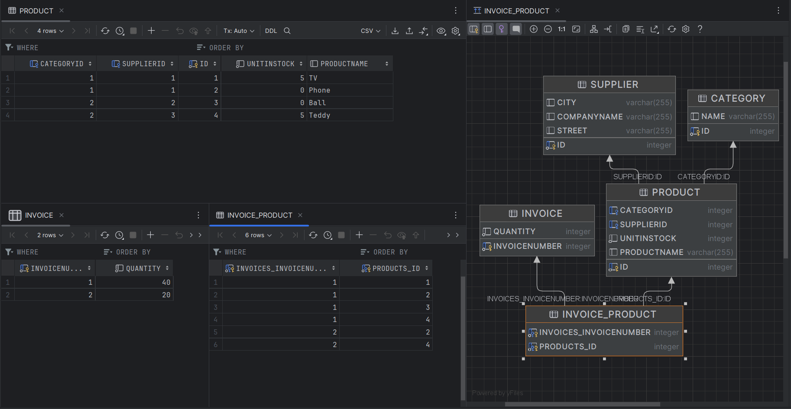

### Kaskady 

##### Klasa Main

```java
public static void main(String[] args) {
        EntityManagerFactory emf = Persistence.createEntityManagerFactory("myDatabaseConfig");
        EntityManager em = emf.createEntityManager();

        Supplier ikea = new Supplier("Ikea", "Main Street", "New York");
        Supplier lidl = new Supplier("Lidl", "Second Street", "Miami");
        Supplier aldi = new Supplier("Aldi", "Kaufingerstraße", "Berlin");

        Product tv = new Product("TV", 15);
        Product phone = new Product("Phone", 20);
        Product ball = new Product("Ball", 10);
        Product teddy = new Product("Teddy", 25);
        List<Product> products = Stream.of(tv,phone, ball, teddy).toList();

        Category electronics = new Category("Electronics");
        Category toys = new Category("Toys");

        tv.setSupplier(ikea);
        tv.setCategory(electronics);

        phone.setSupplier(ikea);
        phone.setCategory(electronics);

        ball.setSupplier(lidl);
        ball.setCategory(toys);

        teddy.setSupplier(aldi);
        teddy.setCategory(toys);

        ikea.add(tv);
        ikea.add(phone);
        lidl.add(ball);
        aldi.add(teddy);

        electronics.add(tv);
        electronics.add(phone);
        toys.add(ball);
        toys.add(teddy);

        int sold = 10;
        Invoice invoice1 =  new Invoice();
        Invoice invoice2 =  new Invoice();
        for(Product product : products){
            try{
                invoice1.add(product, sold);
                product.addInvoice(invoice1);

                invoice2.add(product, sold);
                product.addInvoice(invoice2);

            }catch (IllegalArgumentException e){
                System.err.println(e + product.toString());
            }
        }

        EntityTransaction etx = em.getTransaction();
        etx.begin();

        em.persist(invoice1);
        em.persist(invoice2);

        // SELECT * FROM Product
        List<Product> productList = em.createQuery("from Product", Product.class).getResultList();
        display(productList, Product::toString);

        // SELECT * FROM Supplier
        List<Supplier> supplierList = em.createQuery("from Supplier", Supplier.class).getResultList();
        display(supplierList, Supplier::toString);

        // SELECT * FROM Category
        List<Category> categoryList = em.createQuery("from Category", Category.class).getResultList();
        display(categoryList, Category::toString);

        // SELECT * FROM Invoice
        List<Invoice> invoiceList = em.createQuery("from Invoice", Invoice.class).getResultList();
        display(invoiceList, Invoice::toString);

        etx.commit();
        em.close();
    }

    private static <T> void display(List<T> list, Function<T, String> toString) {
        list.stream()
                .map(toString)
                .forEach(System.out::println);
    }
```

##### Klasa Product

```java
@Entity
public class Product {
    @Id
    @GeneratedValue(strategy = GenerationType.AUTO)
    private int id;
    private String productName;
    private int unitInStock;

    @ManyToOne(cascade = {CascadeType.PERSIST})
    @JoinColumn(name = "SupplierID")
    private Supplier supplier;

    @ManyToOne(cascade = {CascadeType.PERSIST})
    @JoinColumn(name = "CategoryID")
    private Category category;

    @ManyToMany(mappedBy = "products")
    private final Set<Invoice> invoices = new HashSet<>();

    public Product(){}
    public Product(String productName, int unitsInStock){
        this.productName = productName;
        this.unitInStock = unitsInStock;
    }

    public void setSupplier(Supplier supplier){
        this.supplier = supplier;
    }

    public Supplier getSupplier(){
        return supplier;
    }

    public Category getCategory() {
        return category;
    }

    public void setCategory(Category category) {
        this.category = category;
    }

    public String getName(){
        return productName;
    }

    public void addInvoice(Invoice invoice){
        invoices.add(invoice);
    }
    public int getUnitInStock(){
        return unitInStock;
    }
    public void updateUnitInStock(int unitInStock){
        this.unitInStock = unitInStock;
    }
    @Override
    public String toString() {
        return "Product{" +
                "productName='" + productName + '\'' +
                ", unitInStock=" + unitInStock +
                ", supplier=" + supplier +
                ", category=" + category.getName() +
                ", invoices=" + invoices.stream()
                    .map(Invoice::getInvoiceNumber).toList()+
                '}';
    }
}
```

##### Klasa Invoice

```java
@Entity
public class Invoice {
    @Id
    @GeneratedValue(strategy = GenerationType.AUTO)
    private int invoiceNumber;
    private int quantity;
    @ManyToMany(cascade = {CascadeType.PERSIST})
    private final Set<Product> products = new HashSet<>();
    public Invoice(){}
    public void add(Product product, int quantity){
        if(product.getUnitInStock() < quantity){
            throw new IllegalArgumentException("Too small unit in stock: ");
        }
        product.updateUnitInStock(product.getUnitInStock()-quantity);
        products.add(product);
        this.quantity += quantity;
    }
    public int getInvoiceNumber(){
        return invoiceNumber;
    }

    @Override
    public String toString() {
        return "Invoice{" +
                "InvoiceNumber=" + invoiceNumber +
                ", Quantity=" + quantity +
                products.stream().map(Product::getName).toList()+
                '}';
    }
}
```

Klasy Supplier i Category bez zmian.

##### Logi SQl

```sql
Hibernate: 
    create table Category (
        id integer not null,
        name varchar(255),
        primary key (id)
    )
Hibernate: 
    create table Invoice (
        invoiceNumber integer not null,
        quantity integer not null,
        primary key (invoiceNumber)
    )
Hibernate: 
    create table Invoice_Product (
        invoices_invoiceNumber integer not null,
        products_id integer not null,
        primary key (invoices_invoiceNumber, products_id)
    )
Hibernate: 
    create table Product (
        CategoryID integer,
        SupplierID integer,
        id integer not null,
        unitInStock integer not null,
        productName varchar(255),
        primary key (id)
    )
Hibernate: 
    create table Supplier (
        id integer not null,
        City varchar(255),
        CompanyName varchar(255),
        Street varchar(255),
        primary key (id)
    )
Hibernate: 
    alter table Invoice_Product 
       add constraint FKeqaqmkvudj6nt4if9hk8dtafp 
       foreign key (products_id) 
       references Product
Hibernate: 
    alter table Invoice_Product 
       add constraint FKcbqyl9u4eh1tws13u6pk5j2nt 
       foreign key (invoices_invoiceNumber) 
       references Invoice
Hibernate: 
    alter table Product 
       add constraint FKf9oip6g0rdsqr327ymf173jf9 
       foreign key (CategoryID) 
       references Category
Hibernate: 
    alter table Product 
       add constraint FKkgin78bfutrn59mng5xbhor2d 
       foreign key (SupplierID) 
       references Supplier
Hibernate: 
    
values
    next value for Invoice_SEQ
Hibernate: 
    
values
    next value for Product_SEQ
Hibernate: 
    
values
    next value for auto
Hibernate: 
    
values
    next value for Supplier_SEQ
Hibernate: 
    
values
    next value for Product_SEQ
Hibernate: 
    
values
    next value for auto
Hibernate: 
    
values
    next value for Supplier_SEQ
Hibernate: 
    
values
    next value for Invoice_SEQ
Hibernate: 
    insert 
    into
        Invoice
        (quantity, invoiceNumber) 
    values
        (?, ?)
Hibernate: 
    insert 
    into
        Category
        (name, id) 
    values
        (?, ?)
Hibernate: 
    insert 
    into
        Supplier
        (City, CompanyName, Street, id) 
    values
        (?, ?, ?, ?)
Hibernate: 
    insert 
    into
        Product
        (CategoryID, productName, SupplierID, unitInStock, id) 
    values
        (?, ?, ?, ?, ?)
Hibernate: 
    insert 
    into
        Category
        (name, id) 
    values
        (?, ?)
Hibernate: 
    insert 
    into
        Supplier
        (City, CompanyName, Street, id) 
    values
        (?, ?, ?, ?)
Hibernate: 
    insert 
    into
        Product
        (CategoryID, productName, SupplierID, unitInStock, id) 
    values
        (?, ?, ?, ?, ?)
Hibernate: 
    insert 
    into
        Product
        (CategoryID, productName, SupplierID, unitInStock, id) 
    values
        (?, ?, ?, ?, ?)
Hibernate: 
    insert 
    into
        Supplier
        (City, CompanyName, Street, id) 
    values
        (?, ?, ?, ?)
Hibernate: 
    insert 
    into
        Product
        (CategoryID, productName, SupplierID, unitInStock, id) 
    values
        (?, ?, ?, ?, ?)
Hibernate: 
    insert 
    into
        Invoice
        (quantity, invoiceNumber) 
    values
        (?, ?)
Hibernate: 
    insert 
    into
        Invoice_Product
        (invoices_invoiceNumber, products_id) 
    values
        (?, ?)
Hibernate: 
    insert 
    into
        Invoice_Product
        (invoices_invoiceNumber, products_id) 
    values
        (?, ?)
Hibernate: 
    insert 
    into
        Invoice_Product
        (invoices_invoiceNumber, products_id) 
    values
        (?, ?)
Hibernate: 
    insert 
    into
        Invoice_Product
        (invoices_invoiceNumber, products_id) 
    values
        (?, ?)
Hibernate: 
    insert 
    into
        Invoice_Product
        (invoices_invoiceNumber, products_id) 
    values
        (?, ?)
Hibernate: 
    insert 
    into
        Invoice_Product
        (invoices_invoiceNumber, products_id) 
    values
        (?, ?)
Hibernate: 
    select
        p1_0.id,
        p1_0.CategoryID,
        p1_0.productName,
        p1_0.SupplierID,
        p1_0.unitInStock 
    from
        Product p1_0
Hibernate: 
    select
        s1_0.id,
        s1_0.City,
        s1_0.CompanyName,
        s1_0.Street 
    from
        Supplier s1_0
Hibernate: 
    select
        c1_0.id,
        c1_0.name 
    from
        Category c1_0
Hibernate: 
    select
        i1_0.invoiceNumber,
        i1_0.quantity 
    from
        Invoice i1_0
```

##### Dane Wynikowe Programu

```java
java.lang.IllegalArgumentException: Too small unit in stock: 
Product{productName='TV', unitInStock=5, supplier=
Supplier{CompanyName='Ikea', Street='Main Street'}, category=Electronics, invoices=[0]}

java.lang.IllegalArgumentException: Too small unit in stock: 
Product{productName='Ball', unitInStock=0, supplier=
Supplier{CompanyName='Lidl', Street='Second Street'}, category=Toys, invoices=[0]}


Product{productName='Phone', unitInStock=0, supplier=
Supplier{CompanyName='Ikea', Street='Main Street'}, category=Electronics, invoices=[1, 2]}

Product{productName='Teddy', unitInStock=5, supplier=
Supplier{CompanyName='Aldi', Street='Kaufingerstraße'}, category=Toys, invoices=[1, 2]}
Product{productName='TV', unitInStock=5, supplier=
Supplier{CompanyName='Ikea', Street='Main Street'}, category=Electronics, invoices=[1]}

Product{productName='Ball', unitInStock=0, supplier=
Supplier{CompanyName='Lidl', Street='Second Street'}, category=Toys, invoices=[1]}


Supplier{CompanyName='Ikea', Street='Main Street'}
Supplier{CompanyName='Aldi', Street='Kaufingerstraße'}
Supplier{CompanyName='Lidl', Street='Second Street'}


Category{name='Electronics', productList=[TV, Phone]}
Category{name='Toys', productList=[Ball, Teddy]}


Invoice{InvoiceNumber=1, Quantity=40[Phone, Teddy, TV, Ball]}
Invoice{InvoiceNumber=2, Quantity=20[Phone, Teddy]}
```
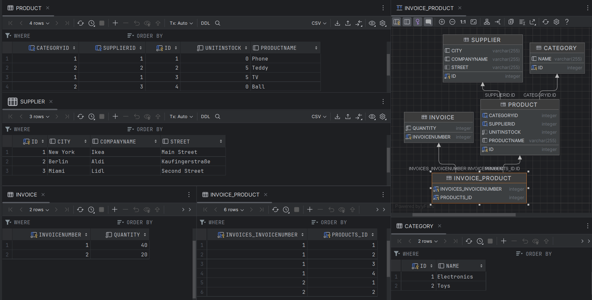


### Embedded class

- #### Bez tabeli 

##### Klasa Main

```java
public static void main(String[] args) {
        EntityManagerFactory emf = Persistence.createEntityManagerFactory("myDatabaseConfig");
        EntityManager em = emf.createEntityManager();

        Address ikeaAddress = new Address("New York","Main Street", "12-123");
        Address lidlAddress = new Address("Miami","Second Street", "10-100");
        Address aldiAddress = new Address("Berlin","Kaufingerstraße", "20-100");

        Supplier ikea = new Supplier("Ikea", ikeaAddress);
        Supplier lidl = new Supplier("Lidl", lidlAddress);
        Supplier aldi = new Supplier("Aldi", aldiAddress);

        Product tv = new Product("TV", 15);
        Product phone = new Product("Phone", 20);
        Product ball = new Product("Ball", 10);
        Product teddy = new Product("Teddy", 25);
        List<Product> products = Stream.of(tv,phone, ball, teddy).toList();

        Category electronics = new Category("Electronics");
        Category toys = new Category("Toys");

        tv.setSupplier(ikea);
        tv.setCategory(electronics);

        phone.setSupplier(ikea);
        phone.setCategory(electronics);

        ball.setSupplier(lidl);
        ball.setCategory(toys);

        teddy.setSupplier(aldi);
        teddy.setCategory(toys);

        ikea.add(tv);
        ikea.add(phone);
        lidl.add(ball);
        aldi.add(teddy);

        electronics.add(tv);
        electronics.add(phone);
        toys.add(ball);
        toys.add(teddy);

        int sold = 10;
        Invoice invoice1 =  new Invoice();
        Invoice invoice2 =  new Invoice();
        for(Product product : products){
            try{
                invoice1.add(product, sold);
                product.addInvoice(invoice1);

                invoice2.add(product, sold);
                product.addInvoice(invoice2);

            }catch (IllegalArgumentException e){
                System.err.println(e + product.toString());
            }
        }

        EntityTransaction etx = em.getTransaction();
        etx.begin();

        em.persist(invoice1);
        em.persist(invoice2);

        // SELECT * FROM Product
        List<Product> productList = em.createQuery("from Product", Product.class).getResultList();
        display(productList, Product::toString);

        // SELECT * FROM Supplier
        List<Supplier> supplierList = em.createQuery("from Supplier", Supplier.class).getResultList();
        display(supplierList, Supplier::toString);

        // SELECT * FROM Category
        List<Category> categoryList = em.createQuery("from Category", Category.class).getResultList();
        display(categoryList, Category::toString);

        // SELECT * FROM Invoice
        List<Invoice> invoiceList = em.createQuery("from Invoice", Invoice.class).getResultList();
        display(invoiceList, Invoice::toString);

        etx.commit();
        em.close();
    }

    private static <T> void display(List<T> list, Function<T, String> toString) {
        list.stream()
                .map(toString)
                .forEach(System.out::println);
    }
```

##### Klasa Address

```java
@Embeddable
public class Address {
    private String city;
    private String street;
    private String zipCode;

    public Address(){};

    public Address(String city, String street, String zipCode){
        this.city = city;
        this.street = street;
        this.zipCode = zipCode;
    }

    public String getCity() {
        return city;
    }

    public void setCity(String city) {
        this.city = city;
    }

    public String getStreet() {
        return street;
    }

    public void setStreet(String street) {
        this.street = street;
    }

    public String getZipCode() {
        return zipCode;
    }

    public void setZipCode(String zipCode) {
        this.zipCode = zipCode;
    }

    @Override
    public String toString() {
        return "Address{" +
                "city='" + city + '\'' +
                ", street='" + street + '\'' +
                ", zipCode='" + zipCode + '\'' +
                '}';
    }
}
```

##### Klasa Supplier

```java
@Entity
public class Supplier {
    @Id
    @GeneratedValue(strategy = GenerationType.AUTO)
    private int id;
    private String companyName;
    @Embedded
    private Address address;
    @OneToMany(mappedBy = "supplier")
    private final List<Product> products = new ArrayList<>();

    public Supplier(String companyName, Address address){
        this.companyName = companyName;
        this.address = address;
    }
    public Supplier() {}

    public void add(Product product){
        products.add(product);
    }

    @Override
    public String toString() {
        return "Supplier{" +
                "CompanyName='" + companyName + '\'' +
                ", Address='" + address + '\'' +
                '}';
    }
}
```
Klasa Product, Category, Invoice bez zmian.

#### Logi SQL

```sql
Hibernate: 
    create table Category (
        id integer not null,
        name varchar(255),
        primary key (id)
    )
Hibernate: 
    create table Invoice (
        invoiceNumber integer not null,
        quantity integer not null,
        primary key (invoiceNumber)
    )
Hibernate: 
    create table Invoice_Product (
        invoices_invoiceNumber integer not null,
        products_id integer not null,
        primary key (invoices_invoiceNumber, products_id)
    )
Hibernate: 
    create table Product (
        CategoryID integer,
        SupplierID integer,
        id integer not null,
        unitInStock integer not null,
        productName varchar(255),
        primary key (id)
    )
Hibernate: 
    create table Supplier (
        id integer not null,
        city varchar(255),
        companyName varchar(255),
        street varchar(255),
        zipCode varchar(255),
        primary key (id)
    )
Hibernate: 
    alter table Invoice_Product 
       add constraint FKeqaqmkvudj6nt4if9hk8dtafp 
       foreign key (products_id) 
       references Product
Hibernate: 
    alter table Invoice_Product 
       add constraint FKcbqyl9u4eh1tws13u6pk5j2nt 
       foreign key (invoices_invoiceNumber) 
       references Invoice
Hibernate: 
    alter table Product 
       add constraint FKf9oip6g0rdsqr327ymf173jf9 
       foreign key (CategoryID) 
       references Category
Hibernate: 
    alter table Product 
       add constraint FKkgin78bfutrn59mng5xbhor2d 
       foreign key (SupplierID) 
       references Supplier
Hibernate: 
    
values
    next value for Invoice_SEQ
Hibernate: 
    
values
    next value for Product_SEQ
Hibernate: 
    
values
    next value for auto
Hibernate: 
    
values
    next value for Supplier_SEQ
Hibernate: 
    
values
    next value for Product_SEQ
Hibernate: 
    
values
    next value for auto
Hibernate: 
    
values
    next value for Supplier_SEQ
Hibernate: 
    
values
    next value for Invoice_SEQ
Hibernate: 
    insert 
    into
        Invoice
        (quantity, invoiceNumber) 
    values
        (?, ?)
Hibernate: 
    insert 
    into
        Category
        (name, id) 
    values
        (?, ?)
Hibernate: 
    insert 
    into
        Supplier
        (city, street, zipCode, companyName, id) 
    values
        (?, ?, ?, ?, ?)
Hibernate: 
    insert 
    into
        Product
        (CategoryID, productName, SupplierID, unitInStock, id) 
    values
        (?, ?, ?, ?, ?)
Hibernate: 
    insert 
    into
        Category
        (name, id) 
    values
        (?, ?)
Hibernate: 
    insert 
    into
        Supplier
        (city, street, zipCode, companyName, id) 
    values
        (?, ?, ?, ?, ?)
Hibernate: 
    insert 
    into
        Product
        (CategoryID, productName, SupplierID, unitInStock, id) 
    values
        (?, ?, ?, ?, ?)
Hibernate: 
    insert 
    into
        Supplier
        (city, street, zipCode, companyName, id) 
    values
        (?, ?, ?, ?, ?)
Hibernate: 
    insert 
    into
        Product
        (CategoryID, productName, SupplierID, unitInStock, id) 
    values
        (?, ?, ?, ?, ?)
Hibernate: 
    insert 
    into
        Product
        (CategoryID, productName, SupplierID, unitInStock, id) 
    values
        (?, ?, ?, ?, ?)
Hibernate: 
    insert 
    into
        Invoice
        (quantity, invoiceNumber) 
    values
        (?, ?)
Hibernate: 
    insert 
    into
        Invoice_Product
        (invoices_invoiceNumber, products_id) 
    values
        (?, ?)
Hibernate: 
    insert 
    into
        Invoice_Product
        (invoices_invoiceNumber, products_id) 
    values
        (?, ?)
Hibernate: 
    insert 
    into
        Invoice_Product
        (invoices_invoiceNumber, products_id) 
    values
        (?, ?)
Hibernate: 
    insert 
    into
        Invoice_Product
        (invoices_invoiceNumber, products_id) 
    values
        (?, ?)
Hibernate: 
    insert 
    into
        Invoice_Product
        (invoices_invoiceNumber, products_id) 
    values
        (?, ?)
Hibernate: 
    insert 
    into
        Invoice_Product
        (invoices_invoiceNumber, products_id) 
    values
        (?, ?)
Hibernate: 
    select
        p1_0.id,
        p1_0.CategoryID,
        p1_0.productName,
        p1_0.SupplierID,
        p1_0.unitInStock 
    from
        Product p1_0
Hibernate: 
    select
        s1_0.id,
        s1_0.city,
        s1_0.street,
        s1_0.zipCode,
        s1_0.companyName 
    from
        Supplier s1_0
Hibernate: 
    select
        c1_0.id,
        c1_0.name 
    from
        Category c1_0
Hibernate: 
    select
        i1_0.invoiceNumber,
        i1_0.quantity 
    from
        Invoice i1_0
```

##### Dane Wynikowe Programu

```java
java.lang.IllegalArgumentException: Too small unit in stock: 
Product{productName='TV', unitInStock=5, supplier=
Supplier{CompanyName='Ikea', Address='Address{city='New York', street='Main Street', zipCode='12-123'}'}, 
category=Electronics, invoices=[0]}

java.lang.IllegalArgumentException: Too small unit in stock: 
Product{productName='Ball', unitInStock=0, supplier=
Supplier{CompanyName='Lidl', Address='Address{city='Miami', street='Second Street', zipCode='10-100'}'}, 
category=Toys, invoices=[0]}


Product{productName='Teddy', unitInStock=5, supplier=
Supplier{CompanyName='Aldi', Address='Address{city='Berlin', street='Kaufingerstraße', zipCode='20-100'}'}, 
category=Toys, invoices=[2, 1]}

Product{productName='TV', unitInStock=5, supplier=
Supplier{CompanyName='Ikea', Address='Address{city='New York', street='Main Street', zipCode='12-123'}'}, 
category=Electronics, invoices=[1]}

Product{productName='Ball', unitInStock=0, supplier=
Supplier{CompanyName='Lidl', Address='Address{city='Miami', street='Second Street', zipCode='10-100'}'}, 
category=Toys, invoices=[1]}

Product{productName='Phone', unitInStock=0, supplier=
Supplier{CompanyName='Ikea', Address='Address{city='New York', street='Main Street', zipCode='12-123'}'}, 
category=Electronics, invoices=[2, 1]}


Supplier{CompanyName='Aldi', Address='Address{city='Berlin', street='Kaufingerstraße', zipCode='20-100'}'}

Supplier{CompanyName='Ikea', Address='Address{city='New York', street='Main Street', zipCode='12-123'}'}

Supplier{CompanyName='Lidl', Address='Address{city='Miami', street='Second Street', zipCode='10-100'}'}


Category{name='Toys', productList=[Ball, Teddy]}
Category{name='Electronics', productList=[TV, Phone]}


Invoice{InvoiceNumber=1, Quantity=40[Teddy, TV, Ball, Phone]}
Invoice{InvoiceNumber=2, Quantity=20[Teddy, Phone]}
```
##### Schemat baz danych, zawartość tabel
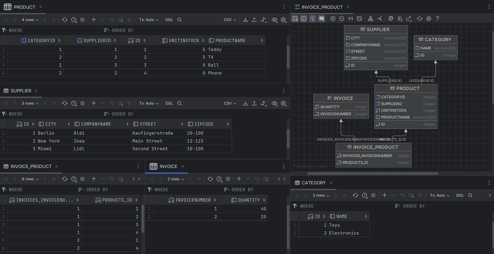

- #### Z tabelą

##### Klasa Main

```java
 public static void main(String[] args) {
        EntityManagerFactory emf = Persistence.createEntityManagerFactory("myDatabaseConfig");
        EntityManager em = emf.createEntityManager();

        Supplier ikea = new Supplier("Ikea", "New York","Main Street", "12-123");
        Supplier lidl = new Supplier("Lidl", "Miami","Second Street", "10-100");
        Supplier aldi = new Supplier("Aldi", "Berlin","Kaufingerstraße", "20-100");

        Product tv = new Product("TV", 15);
        Product phone = new Product("Phone", 20);
        Product ball = new Product("Ball", 10);
        Product teddy = new Product("Teddy", 25);
        List<Product> products = Stream.of(tv,phone, ball, teddy).toList();

        Category electronics = new Category("Electronics");
        Category toys = new Category("Toys");

        tv.setSupplier(ikea);
        tv.setCategory(electronics);

        phone.setSupplier(ikea);
        phone.setCategory(electronics);

        ball.setSupplier(lidl);
        ball.setCategory(toys);

        teddy.setSupplier(aldi);
        teddy.setCategory(toys);

        ikea.add(tv);
        ikea.add(phone);
        lidl.add(ball);
        aldi.add(teddy);

        electronics.add(tv);
        electronics.add(phone);
        toys.add(ball);
        toys.add(teddy);

        int sold = 10;
        Invoice invoice1 =  new Invoice();
        Invoice invoice2 =  new Invoice();
        for(Product product : products){
            try{
                invoice1.add(product, sold);
                product.addInvoice(invoice1);

                invoice2.add(product, sold);
                product.addInvoice(invoice2);

            }catch (IllegalArgumentException e){
                System.err.println(e + product.toString());
            }
        }

        EntityTransaction etx = em.getTransaction();
        etx.begin();

        em.persist(invoice1);
        em.persist(invoice2);

        // SELECT * FROM Product
        List<Product> productList = em.createQuery("from Product", Product.class).getResultList();
        display(productList, Product::toString);

        // SELECT * FROM Supplier
        List<Supplier> supplierList = em.createQuery("from Supplier", Supplier.class).getResultList();
        display(supplierList, Supplier::toString);

        // SELECT * FROM Category
        List<Category> categoryList = em.createQuery("from Category", Category.class).getResultList();
        display(categoryList, Category::toString);

        // SELECT * FROM Invoice
        List<Invoice> invoiceList = em.createQuery("from Invoice", Invoice.class).getResultList();
        display(invoiceList, Invoice::toString);

        etx.commit();
        em.close();
    }

    private static <T> void display(List<T> list, Function<T, String> toString) {
        list.stream()
                .map(toString)
                .forEach(System.out::println);
    }
```

##### Klasa Supplier

```java
@Entity
@SecondaryTable(name = "ADDRESS_SUP")
public class Supplier {
    @Id
    @GeneratedValue(strategy = GenerationType.AUTO)
    private int id;
    private String companyName;
    @Column(table = "ADDRESS_SUP")
    private String city;
    @Column(table = "ADDRESS_SUP")
    private String street;
    @Column(table = "ADDRESS_SUP")
    private String zipCode;
    @OneToMany(mappedBy = "supplier")
    private final List<Product> products = new ArrayList<>();

    public Supplier(String companyName, String city, String street, String zipCode){
        this.companyName = companyName;
        this.city = city;
        this.street = street;
        this.zipCode = zipCode;
    }
    public Supplier() {}

    public void add(Product product){
        products.add(product);
    }

    @Override
    public String toString() {
        return "Supplier{" +
                "id=" + id +
                ", companyName='" + companyName + '\'' +
                ", city='" + city + '\'' +
                ", street='" + street + '\'' +
                ", zipCode='" + zipCode + '\'' +
                ", products=" + products.stream()
                            .map(Product::getName)
                            .toList() +
                '}';
    }
}
```

Klasy Product, Category, Address, Invoice bez zmian.

##### Logi SQL

```sql
Hibernate: 
    create table ADDRESS_SUP (
        id integer not null,
        city varchar(255),
        street varchar(255),
        zipCode varchar(255),
        primary key (id)
    )
Hibernate: 
    create table Category (
        id integer not null,
        name varchar(255),
        primary key (id)
    )
Hibernate: 
    create table Invoice (
        invoiceNumber integer not null,
        quantity integer not null,
        primary key (invoiceNumber)
    )
Hibernate: 
    create table Invoice_Product (
        invoices_invoiceNumber integer not null,
        products_id integer not null,
        primary key (invoices_invoiceNumber, products_id)
    )
Hibernate: 
    create table Product (
        CategoryID integer,
        SupplierID integer,
        id integer not null,
        unitInStock integer not null,
        productName varchar(255),
        primary key (id)
    )
Hibernate: 
    create table Supplier (
        id integer not null,
        companyName varchar(255),
        primary key (id)
    )
Hibernate: 
    alter table ADDRESS_SUP 
       add constraint FKd3vo9ev1socdws4o1kd4rgm9n 
       foreign key (id) 
       references Supplier
Hibernate: 
    alter table Invoice_Product 
       add constraint FKeqaqmkvudj6nt4if9hk8dtafp 
       foreign key (products_id) 
       references Product
Hibernate: 
    alter table Invoice_Product 
       add constraint FKcbqyl9u4eh1tws13u6pk5j2nt 
       foreign key (invoices_invoiceNumber) 
       references Invoice
Hibernate: 
    alter table Product 
       add constraint FKf9oip6g0rdsqr327ymf173jf9 
       foreign key (CategoryID) 
       references Category
Hibernate: 
    alter table Product 
       add constraint FKkgin78bfutrn59mng5xbhor2d 
       foreign key (SupplierID) 
       references Supplier
Hibernate: 
    
values
    next value for Invoice_SEQ
Hibernate: 
    
values
    next value for Product_SEQ
Hibernate: 
    
values
    next value for auto
Hibernate: 
    
values
    next value for Supplier_SEQ
Hibernate: 
    
values
    next value for Product_SEQ
Hibernate: 
    
values
    next value for auto
Hibernate: 
    
values
    next value for Supplier_SEQ
Hibernate: 
    
values
    next value for Invoice_SEQ
Hibernate: 
    insert 
    into
        Invoice
        (quantity, invoiceNumber) 
    values
        (?, ?)
Hibernate: 
    insert 
    into
        Category
        (name, id) 
    values
        (?, ?)
Hibernate: 
    insert 
    into
        Supplier
        (companyName, id) 
    values
        (?, ?)
Hibernate: 
    insert 
    into
        ADDRESS_SUP
        (city, street, zipCode, id) 
    values
        (?, ?, ?, ?)
Hibernate: 
    insert 
    into
        Product
        (CategoryID, productName, SupplierID, unitInStock, id) 
    values
        (?, ?, ?, ?, ?)
Hibernate: 
    insert 
    into
        Category
        (name, id) 
    values
        (?, ?)
Hibernate: 
    insert 
    into
        Supplier
        (companyName, id) 
    values
        (?, ?)
Hibernate: 
    insert 
    into
        ADDRESS_SUP
        (city, street, zipCode, id) 
    values
        (?, ?, ?, ?)
Hibernate: 
    insert 
    into
        Product
        (CategoryID, productName, SupplierID, unitInStock, id) 
    values
        (?, ?, ?, ?, ?)
Hibernate: 
    insert 
    into
        Supplier
        (companyName, id) 
    values
        (?, ?)
Hibernate: 
    insert 
    into
        ADDRESS_SUP
        (city, street, zipCode, id) 
    values
        (?, ?, ?, ?)
Hibernate: 
    insert 
    into
        Product
        (CategoryID, productName, SupplierID, unitInStock, id) 
    values
        (?, ?, ?, ?, ?)
Hibernate: 
    insert 
    into
        Product
        (CategoryID, productName, SupplierID, unitInStock, id) 
    values
        (?, ?, ?, ?, ?)
Hibernate: 
    insert 
    into
        Invoice
        (quantity, invoiceNumber) 
    values
        (?, ?)
Hibernate: 
    insert 
    into
        Invoice_Product
        (invoices_invoiceNumber, products_id) 
    values
        (?, ?)
Hibernate: 
    insert 
    into
        Invoice_Product
        (invoices_invoiceNumber, products_id) 
    values
        (?, ?)
Hibernate: 
    insert 
    into
        Invoice_Product
        (invoices_invoiceNumber, products_id) 
    values
        (?, ?)
Hibernate: 
    insert 
    into
        Invoice_Product
        (invoices_invoiceNumber, products_id) 
    values
        (?, ?)
Hibernate: 
    insert 
    into
        Invoice_Product
        (invoices_invoiceNumber, products_id) 
    values
        (?, ?)
Hibernate: 
    insert 
    into
        Invoice_Product
        (invoices_invoiceNumber, products_id) 
    values
        (?, ?)
Hibernate: 
    select
        p1_0.id,
        p1_0.CategoryID,
        p1_0.productName,
        p1_0.SupplierID,
        p1_0.unitInStock 
    from
        Product p1_0
Hibernate: 
    select
        s1_0.id,
        s1_0.companyName,
        s1_1.city,
        s1_1.street,
        s1_1.zipCode 
    from
        Supplier s1_0 
    left join
        ADDRESS_SUP s1_1 
            on s1_0.id=s1_1.id
Hibernate: 
    select
        c1_0.id,
        c1_0.name 
    from
        Category c1_0
Hibernate: 
    select
        i1_0.invoiceNumber,
        i1_0.quantity 
    from
        Invoice i1_0

```

##### Dane Wynikowe Programu

```java
java.lang.IllegalArgumentException: Too small unit in stock: 
Product{productName='TV', unitInStock=5, supplier=
Supplier{id=0, companyName='Ikea', city='New York', street='Main Street', zipCode='12-123', products=[TV, Phone]}, 
category=Electronics, invoices=[0]}

java.lang.IllegalArgumentException: Too small unit in stock: 
Product{productName='Ball', unitInStock=0, supplier=
Supplier{id=0, companyName='Lidl', city='Miami', street='Second Street', zipCode='10-100', products=[Ball]}, 
category=Toys, invoices=[0]}


Product{productName='Ball', unitInStock=0, supplier=
Supplier{id=1, companyName='Lidl', city='Miami', street='Second Street', zipCode='10-100', products=[Ball]}, 
category=Toys, invoices=[1]}

Product{productName='TV', unitInStock=5, supplier=
Supplier{id=2, companyName='Ikea', city='New York', street='Main Street', zipCode='12-123', products=[TV, Phone]}, 
category=Electronics, invoices=[1]}

Product{productName='Teddy', unitInStock=5, supplier=
Supplier{id=3, companyName='Aldi', city='Berlin', street='Kaufingerstraße', zipCode='20-100', products=[Teddy]}, 
category=Toys, invoices=[2, 1]}

Product{productName='Phone', unitInStock=0, supplier=
Supplier{id=2, companyName='Ikea', city='New York', street='Main Street', zipCode='12-123', products=[TV, Phone]}, 
category=Electronics, invoices=[2, 1]}


Supplier{id=1, companyName='Lidl', city='Miami', street='Second Street', zipCode='10-100', products=[Ball]}

Supplier{id=2, companyName='Ikea', city='New York', street='Main Street', zipCode='12-123', products=[TV, Phone]}

Supplier{id=3, companyName='Aldi', city='Berlin', street='Kaufingerstraße', zipCode='20-100', products=[Teddy]}


Category{name='Toys', productList=[Ball, Teddy]}
Category{name='Electronics', productList=[TV, Phone]}


Invoice{InvoiceNumber=1, Quantity=40[Ball, TV, Teddy, Phone]}
Invoice{InvoiceNumber=2, Quantity=20[Teddy, Phone]}
```

##### Schemat baz danych, zawartość tabel
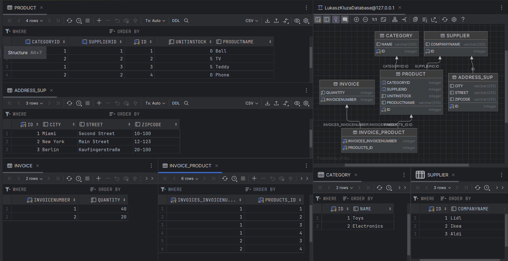

### Dziedziczenie

##### Klasa Main

```java
public static void main(String[] args) {
        EntityManagerFactory emf = Persistence.createEntityManagerFactory("myDatabaseConfig");
        EntityManager em = emf.createEntityManager();

        Supplier ikea = new Supplier("Ikea", "New York","Main Street", "12-123","US44123456789012345623191234511298");
        Supplier lidl = new Supplier("Lidl", "Miami","Second Street", "10-100","US442334567893902345678901234567890");
        Supplier aldi = new Supplier("Aldi", "Berlin","Kaufingerstraße", "20-100","PL441911567891912345678901234587659");

        Customer zabka = new Customer("Zabka", "Warsaw", "Marszalkowska", "20-100", 0.10);
        Customer abc = new Customer("ABC", "Cracow", "Czarnowiejska", "10-120", 0.15);

        EntityTransaction etx = em.getTransaction();
        etx.begin();
        em.persist(ikea);
        em.persist(lidl);
        em.persist(aldi);

        em.persist(zabka);
        em.persist(abc);

        etx.commit();
        em.close();
    }
```

#### TABLE_PER_CLASS

##### Klasa Company

```java
@Entity
@Inheritance(strategy= InheritanceType.TABLE_PER_CLASS)
public class Company {
    @Id
    @GeneratedValue(strategy = GenerationType.AUTO)
    private int id;
    private String companyName;
    private String city;
    private String street;
    private String zipCode;

    public Company(String companyName, String city, String street, String zipCode){
        this.companyName = companyName;
        this.city = city;
        this.street = street;
        this.zipCode = zipCode;
    }
    public Company() {}

    @Override
    public String toString() {
        return "Company{" +
                "id=" + id +
                ", companyName='" + companyName + '\'' +
                ", city='" + city + '\'' +
                ", street='" + street + '\'' +
                ", zipCode='" + zipCode + '\'' +
                '}';
    }
}
```
##### Klasa Customer

```java
@Entity
public class Customer extends Company{
    private double discount;
    public Customer(){};

    public Customer(String companyName, String city, String street, String zipCode, double discount){
        super(companyName, city, street, zipCode);
        this.discount = discount;
    }
    @Override
    public String toString() {
        return "Customer{" + super.toString() + '}';
    }
}
```
##### Klada Supplier

```java
@Entity
public class Supplier extends Company{

    private String bankAccountNumber;
    public Supplier(String companyName, String city, String street, String zipCode, String bankAccountNumber){
        super(companyName, city, street, zipCode);
        this.bankAccountNumber = bankAccountNumber;
    }
    public Supplier() {}
}
```

##### Logi SQL

```sql
Hibernate: 
    create table Category (
        id integer not null,
        name varchar(255),
        primary key (id)
    )
Hibernate: 
    create table Company (
        id integer not null,
        city varchar(255),
        companyName varchar(255),
        street varchar(255),
        zipCode varchar(255),
        primary key (id)
    )
Hibernate: 
    create table Customer (
        discount float(52) not null,
        id integer not null,
        city varchar(255),
        companyName varchar(255),
        street varchar(255),
        zipCode varchar(255),
        primary key (id)
    )
Hibernate: 
    create table Invoice (
        invoiceNumber integer not null,
        quantity integer not null,
        primary key (invoiceNumber)
    )
Hibernate: 
    create table Invoice_Product (
        invoices_invoiceNumber integer not null,
        products_id integer not null,
        primary key (invoices_invoiceNumber, products_id)
    )
Hibernate: 
    create table Product (
        CategoryID integer,
        SupplierID integer,
        id integer not null,
        unitInStock integer not null,
        productName varchar(255),
        primary key (id)
    )
Hibernate: 
    create table Supplier (
        id integer not null,
        bankAccountNumber varchar(255),
        city varchar(255),
        companyName varchar(255),
        street varchar(255),
        zipCode varchar(255),
        primary key (id)
    )
Hibernate: 
    alter table Invoice_Product 
       add constraint FKeqaqmkvudj6nt4if9hk8dtafp 
       foreign key (products_id) 
       references Product
Hibernate: 
    alter table Invoice_Product 
       add constraint FKcbqyl9u4eh1tws13u6pk5j2nt 
       foreign key (invoices_invoiceNumber) 
       references Invoice
Hibernate: 
    alter table Product 
       add constraint FKf9oip6g0rdsqr327ymf173jf9 
       foreign key (CategoryID) 
       references Category
Hibernate: 
    alter table Product 
       add constraint FKkgin78bfutrn59mng5xbhor2d 
       foreign key (SupplierID) 
       references Supplier
Hibernate: 
    
values
    next value for Company_SEQ
Hibernate: 
    
values
    next value for Company_SEQ
Hibernate: 
    insert 
    into
        Supplier
        (city, companyName, street, zipCode, bankAccountNumber, id) 
    values
        (?, ?, ?, ?, ?, ?)
Hibernate: 
    insert 
    into
        Supplier
        (city, companyName, street, zipCode, bankAccountNumber, id) 
    values
        (?, ?, ?, ?, ?, ?)
Hibernate: 
    insert 
    into
        Supplier
        (city, companyName, street, zipCode, bankAccountNumber, id) 
    values
        (?, ?, ?, ?, ?, ?)
Hibernate: 
    insert 
    into
        Customer
        (city, companyName, street, zipCode, discount, id) 
    values
        (?, ?, ?, ?, ?, ?)
Hibernate: 
    insert 
    into
        Customer
        (city, companyName, street, zipCode, discount, id) 
    values
        (?, ?, ?, ?, ?, ?)
```


##### Schemat baz danych, zawartość tabel
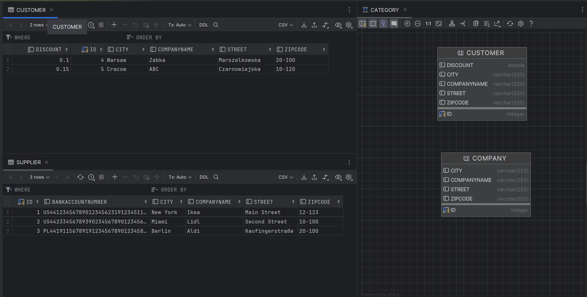


- #### JOINED
  
W klasie __Company__ ustawiamy

```java
@Inheritance(strategy= InheritanceType.JOINED)
```

##### Logi SQL

```java
Hibernate: 
    create table Category (
        id integer not null,
        name varchar(255),
        primary key (id)
    )
Hibernate: 
    create table Company (
        id integer not null,
        city varchar(255),
        companyName varchar(255),
        street varchar(255),
        zipCode varchar(255),
        primary key (id)
    )
Hibernate: 
    create table Customer (
        discount float(52) not null,
        id integer not null,
        primary key (id)
    )
Hibernate: 
    create table Invoice (
        invoiceNumber integer not null,
        quantity integer not null,
        primary key (invoiceNumber)
    )
Hibernate: 
    create table Invoice_Product (
        invoices_invoiceNumber integer not null,
        products_id integer not null,
        primary key (invoices_invoiceNumber, products_id)
    )
Hibernate: 
    create table Product (
        CategoryID integer,
        SupplierID integer,
        id integer not null,
        unitInStock integer not null,
        productName varchar(255),
        primary key (id)
    )
Hibernate: 
    create table Supplier (
        id integer not null,
        bankAccountNumber varchar(255),
        primary key (id)
    )
Hibernate: 
    alter table Customer 
       add constraint FKq1ygf69qcyg90tnylrbrdngs2 
       foreign key (id) 
       references Company
Hibernate: 
    alter table Invoice_Product 
       add constraint FKeqaqmkvudj6nt4if9hk8dtafp 
       foreign key (products_id) 
       references Product
Hibernate: 
    alter table Invoice_Product 
       add constraint FKcbqyl9u4eh1tws13u6pk5j2nt 
       foreign key (invoices_invoiceNumber) 
       references Invoice
Hibernate: 
    alter table Product 
       add constraint FKf9oip6g0rdsqr327ymf173jf9 
       foreign key (CategoryID) 
       references Category
Hibernate: 
    alter table Product 
       add constraint FKkgin78bfutrn59mng5xbhor2d 
       foreign key (SupplierID) 
       references Supplier
Hibernate: 
    alter table Supplier 
       add constraint FKdxd8s9sq0jvymoabbjjx8q5cm 
       foreign key (id) 
       references Company
Hibernate: 
    
values
    next value for Company_SEQ
Hibernate: 
    
values
    next value for Company_SEQ
Hibernate: 
    insert 
    into
        Company
        (city, companyName, street, zipCode, id) 
    values
        (?, ?, ?, ?, ?)
Hibernate: 
    insert 
    into
        Supplier
        (bankAccountNumber, id) 
    values
        (?, ?)
Hibernate: 
    insert 
    into
        Company
        (city, companyName, street, zipCode, id) 
    values
        (?, ?, ?, ?, ?)
Hibernate: 
    insert 
    into
        Supplier
        (bankAccountNumber, id) 
    values
        (?, ?)
Hibernate: 
    insert 
    into
        Company
        (city, companyName, street, zipCode, id) 
    values
        (?, ?, ?, ?, ?)
Hibernate: 
    insert 
    into
        Supplier
        (bankAccountNumber, id) 
    values
        (?, ?)
Hibernate: 
    insert 
    into
        Company
        (city, companyName, street, zipCode, id) 
    values
        (?, ?, ?, ?, ?)
Hibernate: 
    insert 
    into
        Customer
        (discount, id) 
    values
        (?, ?)
Hibernate: 
    insert 
    into
        Company
        (city, companyName, street, zipCode, id) 
    values
        (?, ?, ?, ?, ?)
Hibernate: 
    insert 
    into
        Customer
        (discount, id) 
    values
        (?, ?)
```

##### Schemat baz danych, zawartość tabel
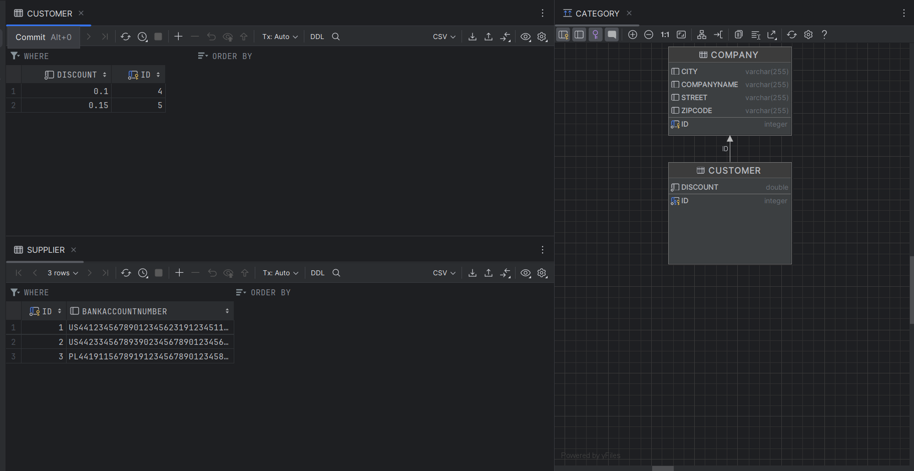

#### Single_Table

W klasie __Company__ ustawiamy : 
```java
@Inheritance(strategy = InheritanceType.SINGLE_TABLE)
```
 
#### Logi SQl

```sql
Hibernate: 
    create table Category (
        id integer not null,
        name varchar(255),
        primary key (id)
    )
Hibernate: 
    create table Company (
        discount float(52),
        id integer not null,
        DTYPE varchar(31) not null,
        bankAccountNumber varchar(255),
        city varchar(255),
        companyName varchar(255),
        street varchar(255),
        zipCode varchar(255),
        primary key (id)
    )
Hibernate: 
    create table Invoice (
        invoiceNumber integer not null,
        quantity integer not null,
        primary key (invoiceNumber)
    )
Hibernate: 
    create table Invoice_Product (
        invoices_invoiceNumber integer not null,
        products_id integer not null,
        primary key (invoices_invoiceNumber, products_id)
    )
Hibernate: 
    create table Product (
        CategoryID integer,
        SupplierID integer,
        id integer not null,
        unitInStock integer not null,
        productName varchar(255),
        primary key (id)
    )
Hibernate: 
    alter table Invoice_Product 
       add constraint FKeqaqmkvudj6nt4if9hk8dtafp 
       foreign key (products_id) 
       references Product
Hibernate: 
    alter table Invoice_Product 
       add constraint FKcbqyl9u4eh1tws13u6pk5j2nt 
       foreign key (invoices_invoiceNumber) 
       references Invoice
Hibernate: 
    alter table Product 
       add constraint FKf9oip6g0rdsqr327ymf173jf9 
       foreign key (CategoryID) 
       references Category
Hibernate: 
    alter table Product 
       add constraint FKisr309y9uql5eiehiq57qxkwx 
       foreign key (SupplierID) 
       references Company
Hibernate: 
    
values
    next value for Company_SEQ
Hibernate: 
    
values
    next value for Company_SEQ
Hibernate: 
    insert 
    into
        Company
        (city, companyName, street, zipCode, bankAccountNumber, DTYPE, id) 
    values
        (?, ?, ?, ?, ?, 'Supplier', ?)
Hibernate: 
    insert 
    into
        Company
        (city, companyName, street, zipCode, bankAccountNumber, DTYPE, id) 
    values
        (?, ?, ?, ?, ?, 'Supplier', ?)
Hibernate: 
    insert 
    into
        Company
        (city, companyName, street, zipCode, bankAccountNumber, DTYPE, id) 
    values
        (?, ?, ?, ?, ?, 'Supplier', ?)
Hibernate: 
    insert 
    into
        Company
        (city, companyName, street, zipCode, discount, DTYPE, id) 
    values
        (?, ?, ?, ?, ?, 'Customer', ?)
Hibernate: 
    insert 
    into
        Company
        (city, companyName, street, zipCode, discount, DTYPE, id) 
    values
        (?, ?, ?, ?, ?, 'Customer', ?)
```

##### Schemat baz danych, zawartość tabel
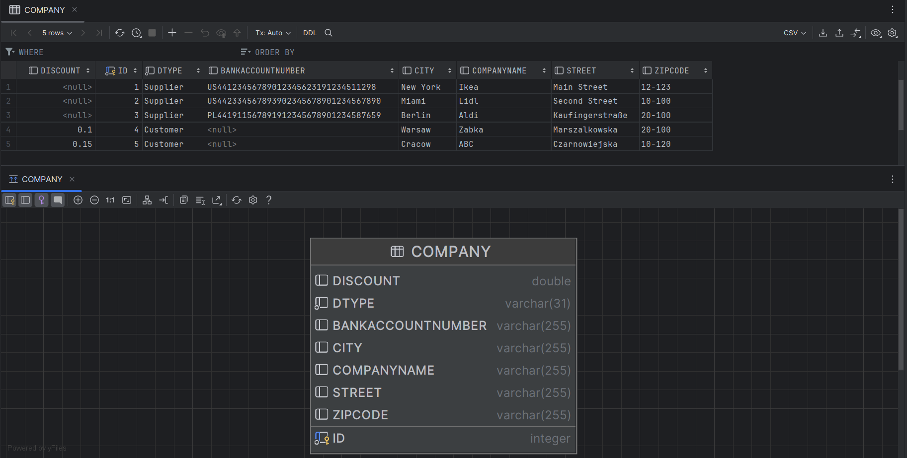